# C++ 内存管理 · 第一讲 primitives

本讲围绕 C++ 内存管理的「基础构件 primitives」展开，核心结论：

1. C++ 中有多种内存分配/释放方式，其中 `new/delete` 最终依赖 `operator new/operator delete`，而后者通常依赖 `malloc/free`。
2. `new` 不只是分配内存，还会调用构造函数；`delete` 不只是释放内存，还会调用析构函数。
3. 数组分配必须使用 `new[]` / `delete[]`，否则可能导致资源泄漏。
4. 可以通过重载类内 `operator new/delete` 实现专属内存池，减少 `malloc` 调用次数和 cookie 开销。
5. 将内存池逻辑抽取为通用 allocator，是向标准库分配器演进的关键一步。
6. `=default` 用于请求编译器生成默认版本，`=delete` 用于禁止某个函数；但 `operator new/delete` 没有可默认生成的版本。

---

## 一、四种内存分配和释放方法

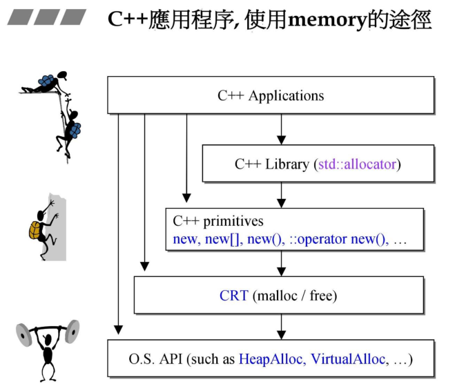

在编程时可以通过上图的几种方法直接或间接地操作内存。下面将介绍四种 C++ 内存操作方法：

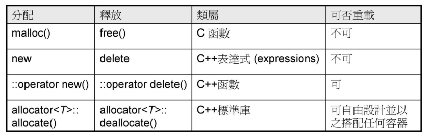

通常可以使用 `malloc` 和 `new` 来分配内存，当然也可以使用 `::operator new()` 和分配器 `allocator` 来操作内存。对于不同的编译器，其 `allocate` 函数的接口也有所不同：

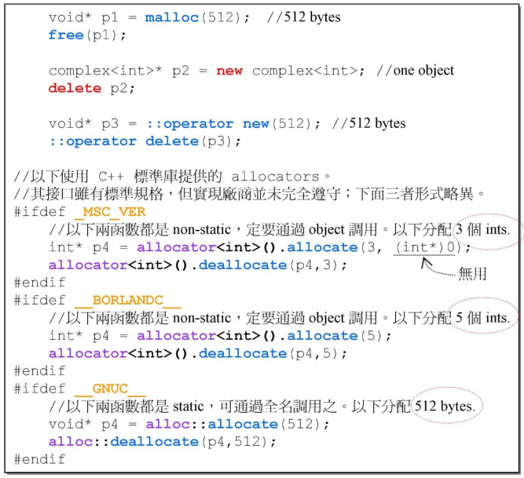

`allocator<int>` 形成了一个类型，后面加 `()` 创建了一个临时对象，生命周期就是这条赋值语句。

对于 GNU C，不同版本又有所不同：

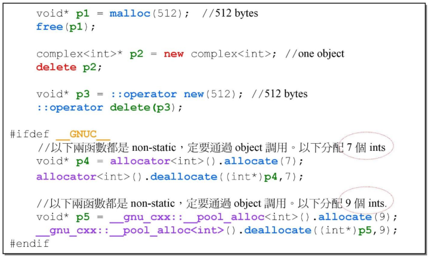

这张图中的 `__gnu_cxx::__pool_alloc<T>().allocate()` 对应于上张图中的 `allocator<T>().allocate()`。

通过 `malloc` 和 `new` 分配内存、通过 `free` 和 `delete` 释放内存是十分常用的，通过 `::operator new` 操作内存比较少见，`allocator` 分配器操作内存在 STL 源码中使用较多，对于不同的编译环境使用也有所不同。下面这个例子是基于 VS2013 环境做测试的：

```cpp
#include <iostream>
#include <complex>
#include <memory>				 //std::allocator
//#include <ext\pool_allocator.h>	 //GCC使用，欲使用 std::allocator 以外的 allocator, 就得自行 #include <ext/...>
using namespace std;
namespace jj01
{
	void test_primitives()
	{
		cout << "\ntest_primitives().......... \n";

		void* p1 = malloc(512);	//512 bytes
		free(p1);

		complex<int>* p2 = new complex<int>; //one object
		delete p2;

		void* p3 = ::operator new(512); //512 bytes
		::operator delete(p3);

		//以下使用 C++ 標準庫提供的 allocators。
		//其接口雖有標準規格，但實現廠商並未完全遵守；下面三者形式略異。
#ifdef _MSC_VER
		//以下兩函數都是 non-static，定要通過 object 調用。以下分配 3 個 ints.
		int* p4 = allocator<int>().allocate(3, (int*)0);
		p4[0] = 666;
		p4[1] = 999;
		p4[2] = 888;
		cout << "p4[0] = " << p4[0] << endl;
		cout << "p4[1] = " << p4[1] << endl;
		cout << "p4[2] = " << p4[2] << endl;
		allocator<int>().deallocate(p4, 3);
#endif
#ifdef __BORLANDC__
		//以下兩函數都是 non-static，定要通過 object 調用。以下分配 5 個 ints.
		int* p4 = allocator<int>().allocate(5);
		allocator<int>().deallocate(p4, 5);
#endif
#ifdef __GNUC__
		//以下兩函數都是 static，可通過全名調用之。以下分配 512 bytes.
		//void* p4 = alloc::allocate(512);
		//alloc::deallocate(p4,512);

		//以下兩函數都是 non-static，定要通過 object 調用。以下分配 7 個 ints.
		void* p4 = allocator<int>().allocate(7);
		allocator<int>().deallocate((int*)p4, 7);

		//以下兩函數都是 non-static，定要通過 object 調用。以下分配 9 個 ints.
		void* p5 = __gnu_cxx::__pool_alloc<int>().allocate(9);
		__gnu_cxx::__pool_alloc<int>().deallocate((int*)p5, 9);
#endif
	}
} //namespace

int main(void)
{
	jj01::test_primitives();
	return 0;
}
```

编译运行结果如下：

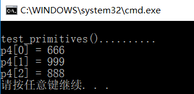

可见 `int* p4 = allocator<int>().allocate(3, (int*)0)` 操作成功申请了三个 int 的空间。

---

## 二、基本构件之 new/delete expression

### 1、内存申请

`new` 做两个动作：分配一块内存、分配好后调用构造函数。

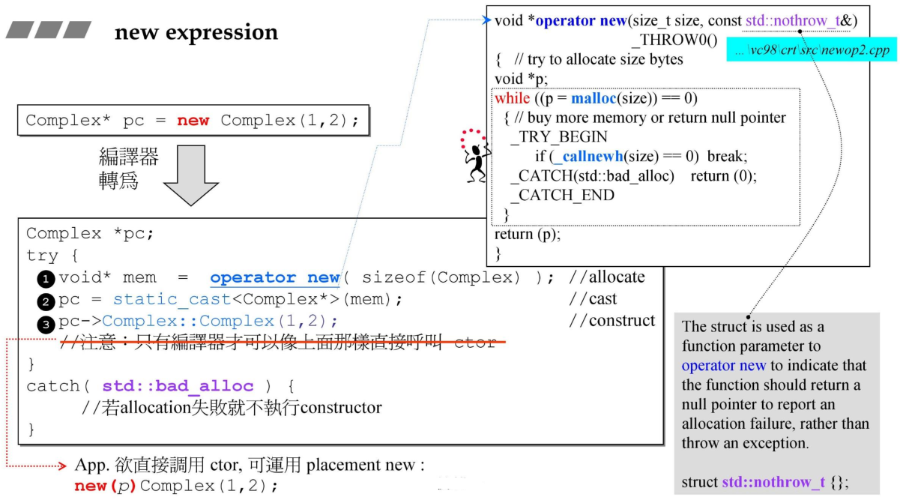

注意 `pc` 指针调用构造函数时需要加类名。大部分编译器是不允许直接这样调用构造函数的。标准写法应该是 placement new：`new (pc) Complex(1, 2);`

上面这张图揭示了 new 操作背后编译器做的事：

1. 第一步通过 `operator new()` 操作分配一个目标类型的内存大小，这里是 `Complex` 的大小；
2. 第二步通过 `static_cast` 将得到的内存块强制转换为目标类型指针，这里是 `Complex*`；
3. 第三步调用目标类型的构造方法。需要注意的是，直接通过 `pc->Complex::Complex(1, 2)` 这样的方法调用构造函数只有编译器可以做，用户这样做将产生错误。

值得注意的是，`operator new()` 操作的内部是调用了 `malloc()` 函数。

### 2、内存释放

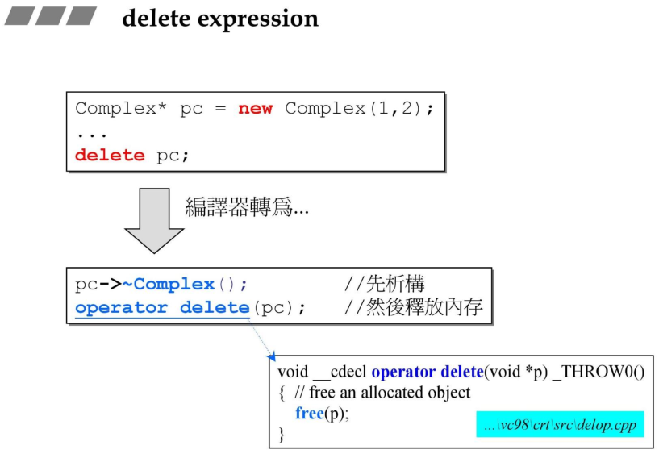

同样地，`delete` 操作第一步也是调用了对象的析构函数，然后再通过 `operator delete()` 函数释放内存，本质上也是调用了 `free` 函数。

### 3、模拟编译器直接调用构造和析构函数

下面的代码测试环境为 VS2013：

```cpp
#include <iostream>
#include <string>
//#include <memory>				 //std::allocator
using namespace std;

namespace jj02
{

	class A
	{
	public:
		int id;

		A() : id(0)      { cout << "default ctor. this=" << this << " id=" << id << endl; }
		A(int i) : id(i) { cout << "ctor. this=" << this << " id=" << id << endl; }
		~A()             { cout << "dtor. this=" << this << " id=" << id << endl; }
	};

	void test_call_ctor_directly()
	{
		cout << "\ntest_call_ctor_directly().......... \n";

		string* pstr = new string;
		cout << "str= " << *pstr << endl;
		//! pstr->string::string("jjhou");
		//[Error] 'class std::basic_string<char>' has no member named 'string'
		//! pstr->~string();	//crash -- 其語法語意都是正確的, crash 只因為上一行被 remark 起來嘛.
		cout << "str= " << *pstr << endl;

		//------------

		A* pA = new A(1);         	//ctor. this=000307A8 id=1
		cout << pA->id << endl;   	//1
		pA->A::A(3); // 因为前面已经new过了 所以pA指向了一个存在的对象，此时再调用构造函数的意思是试图在同一个对象上再次调用构造函数，让它重新构造成：id = 3.
		cout << pA->id << endl;
		//!	pA->A::A(3);                //in VC6 : ctor. this=000307A8 id=3
		//in GCC : [Error] cannot call constructor 'jj02::A::A' directly

		A::A(5); // 直接调用构造函数
		//!	A::A(5);	  				//in VC6 : ctor. this=0013FF60 id=5
		//         dtor. this=0013FF60
		//in GCC : [Error] cannot call constructor 'jj02::A::A' directly
		//         [Note] for a function-style cast, remove the redundant '::A'

		cout << pA->id << endl;   	//in VC6 : 3
		//in GCC : 1

		delete pA;                	//dtor. this=000307A8

		//simulate new
		void* p = ::operator new(sizeof(A));
		cout << "p=" << p << endl; 	//p=000307A8
		pA = static_cast<A*>(p);
		pA->A::A(2);
		//!	pA->A::A(2);				//in VC6 : ctor. this=000307A8 id=2
		//in GCC : [Error] cannot call constructor 'jj02::A::A' directly

		cout << pA->id << endl;     //in VC6 : 2
		//in GCC : 0

		//simulate delete
		pA->~A();					//dtor. this=000307A8
		::operator delete(pA);		//free()
	}
} //namespace

int main(void)
{
	jj02::test_call_ctor_directly();
	return 0;
}
```

编译运行结果如下：

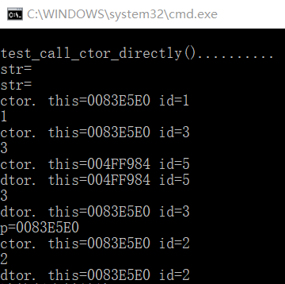

VS 下可以直接通过内存空间调用构造函数，但侯捷测试在 GNU C 下无法通过，具体内容可见代码注解和打印效果。

---

## 三、Array new

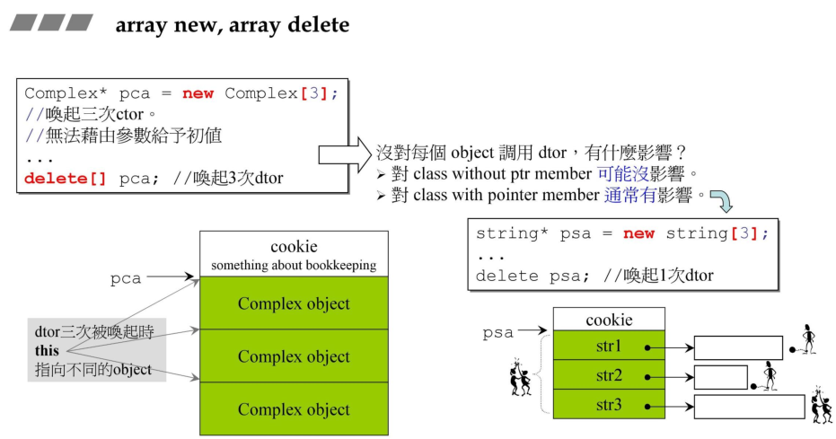

当 `new` 了一个数组对象时，系统会分配一个 cookie 给你，cookie 最重要的是记录整个数组的长度。

上图主要展示的是关于 new array 内存分配的大致情况。当 new 一个数组对象时（例如 `new Complex[3]`），编译器将分配一块内存，这块内存首部是关于对象内存分配的一些标记，然后下面会分配三个连续的对象内存，在使用 delete 释放内存时需要使用 `delete[]`。如果不使用 `delete[]`，只是使用 `delete` 只会将分配的三块内存空间释放，但不会调用对象的析构函数。如果对象内部还使用了 new 指向其他空间，若该空间里对象的析构函数没有意义，那么不会造成问题；如果有意义，那么由于该部分对象析构函数不会调用，将会导致内存泄漏。图中 `new string[3]` 便是一个例子，虽然 `str[0]`、`str[1]`、`str[2]` 被析构了，但只是调用了 `str[0]` 的析构函数，其他对象的析构函数不被调用，这里就会出问题。

图中说「可能没影响」，只是说如果类没有指针成员（有指针，该指针可能指向一个堆空间、需要调用析构函数释放资源）、析构函数没事可做，没有额外的资源需要释放，少调用析构函数可能看不出明显问题；但从 C++ 规则上，`new[]` 必须配 `delete[]`，否则就是错误写法。

> `ctor` = constructor = 构造函数；`dtor` = destructor = 析构函数

再详细解释下 new 一个数组对象、但 delete 时没加中括号会发生什么。先看加中括号的情况：

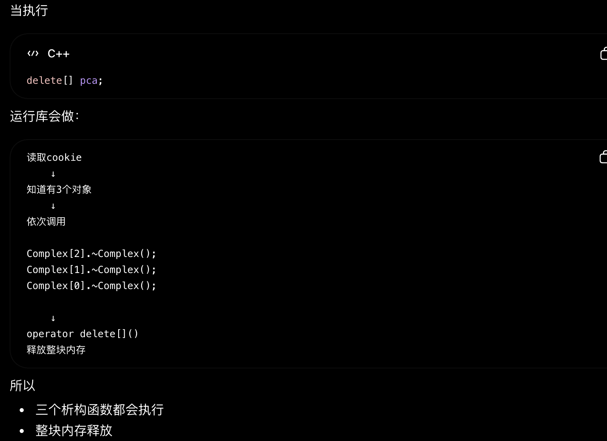

如果不加中括号，`delete pca;` 会被解析成：

```cpp
pca->~Complex();   // 一次析构
operator delete(pca); // 释放内存
```

对于编译器来说，它认为 `pca` 指向的是一个 `Complex` 对象，所以只会调用一个对象的析构函数。但 `operator delete` 会把 new 申请的整个内存释放掉。也就是说另外两个对象的析构函数不会被调用，但它们占用的堆内存会被释放掉。那什么时候会发生内存泄漏呢？当 `Complex` 对象里面有指针指向堆内存，由于没有调用析构函数，因此会内存泄漏。

所以真正泄漏的是对象管理的资源，不一定是对象本身那块内存。

下面将演示数组对象创建与析构过程：

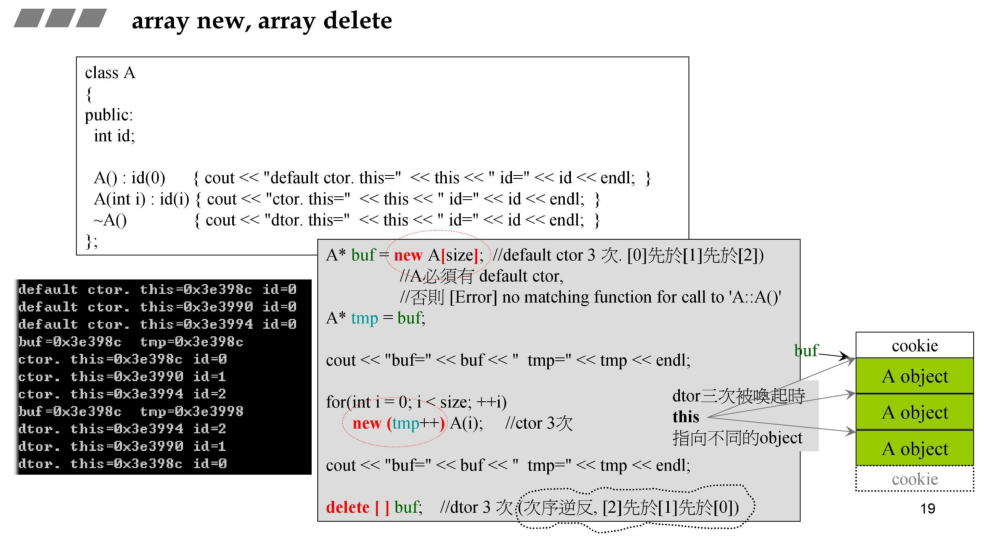

必须有一个默认构造函数，因为 `new A[size]` 没办法给每个对象赋初始值，只能调用默认的构造函数。构造的时候从小地址往大地址；析构的时候是从大地址往小地址。

```cpp
#include <iostream>
#include <new>		//placement new
using namespace std;

namespace jj03
{

	class A
	{
	public:
		int id;

		A() : id(0)      { cout << "default ctor. this=" << this << " id=" << id << endl; }
		A(int i) : id(i) { cout << "ctor. this=" << this << " id=" << id << endl; }
		~A()             { cout << "dtor. this=" << this << " id=" << id << endl; }
	};

	void test_array_new_and_placement_new()
	{
		cout << "\ntest_placement_new().......... \n";

		size_t size = 3;

		{
			//case 1
			//模擬 memory pool 的作法, array new + placement new. 崩潰

			A* buf = (A*)(new char[sizeof(A)*size]);
			A* tmp = buf;

			cout << "buf=" << buf << "  tmp=" << tmp << endl;

			for (int i = 0; i < size; ++i)
				new (tmp++) A(i);  			//3次 调用ctor

			cout << "buf=" << buf << "  tmp=" << tmp << endl;

			//!	delete [] buf;    	//crash. why?
			//因為這其實是個 char array，看到 delete [] buf; 編譯器會企圖喚起多次 A::~A.
			// 但 array memory layout 中找不到與 array 元素個數 (本例 3) 相關的信息,
			// -- 整個格局都錯亂 (從我對 VC 的認識而言)，於是崩潰。
			delete buf;     	//dtor just one time, ~[0]

			cout << "\n\n";
		}

		{
			//case 2
			//回頭測試單純的 array new

			A* buf = new A[size];  //default ctor 3 次. [0]先於[1]先於[2])
			//A必須有 default ctor, 否則 [Error] no matching function for call to 'jj02::A::A()'
			A* tmp = buf;

			cout << "buf=" << buf << "  tmp=" << tmp << endl;

			for (int i = 0; i < size; ++i)
				new (tmp++) A(i);  		//3次 ctor

			cout << "buf=" << buf << "  tmp=" << tmp << endl;

			delete[] buf;    //dtor three times (次序逆反, [2]先於[1]先於[0])
		}

		{
			//case 3
			//掌握崩潰原因, 再次模擬 memory pool作法, array new + placement new.
			//不, 不做了, 因為 memory pool 只是供應 memory, 它並不管 construction,
			//也不管 destruction. 它只負責回收 memory.
			//所以它是以 void* 或 char* 取得 memory, 釋放 (刪除)的也是 void* or char*.
			//不像本例 case 1 釋放 (刪除) 的是 A*.
			//
			//事實上 memory pool 形式如 jj04::test
		}

	}
} //namespace

int main(void)
{
	jj03::test_array_new_and_placement_new();
	return 0;
}
```

编译运行结果如下：

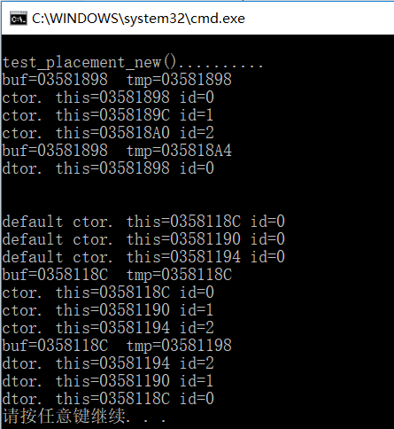

构造函数调用顺序是按照构建对象顺序来执行的，但是析构函数执行却相反。值得注意的是，在调用了 delete 的大括号代码段中，数组有三个元素，但最后只调用了第一个对象的析构函数。

接下来更具体地展示 new array 对象的内存分配情况：

内存空间中上下两个 `61h` 就是 cookies。

![new int[10] 的内存布局](attachments/primitives-13.png)

如果使用 new 分配十个 int 的内存，内存空间如上图所示：首先内存块会有一个头和尾，黄色部分为 debug 信息，灰色部分才是真正使用到的内存，蓝色部分的 12 bytes 是为了让该内存块以 16 字节对齐。在这个例子中 `delete pi` 和 `delete[] pi` 效果是一样的，因为 int 没有析构函数。但下面的例子就不一样了：

![new Demo[3] 的内存布局](attachments/primitives-14.png)

上图通过 new 申请三个 Demo 空间大小，内存块使用了 96 byte，是这样计算得到的：黄色部分调试信息 32 + 4 = 36 byte；黄色部分下面的「3」用于标记实际分配给对象的内存个数，这里是三个所以内容为 3，消耗 4 byte；Demo 内有三个 int 类型成员变量，一个 Demo 消耗 3 × 4 = 12 byte，有三个 Demo，所以消耗 12 × 3 = 36 byte；到目前为止消耗 36 + 4（no man land 的大小）+ 36（Debugger Header + 标记 3）= 76 byte，加上头尾 cookie 一共 8 byte 共 84 byte，由于需要 16 字节对齐，填充蓝色部分 12 byte，一共 84 + 12 = 96 byte。96 转换成十六进制就是 `60h`，堆管理器可能会用最低位记录状态，比如「这个块正在被使用」，`60h + 1` 就是 `61h`。这里释放内存时需要加 `delete[]`，因为上面分配内存中有个标记「3」，编译器将释放三个 Demo 对象空间，不加就会报错。

再来理解「用最低位记录状态」是什么意思：内存块大小就是 96（`0x60`）个字节，cookie 本来应该记录 96 个字节。但由于内存块按 16 字节对齐，块大小一定是 16 的倍数，所以块大小的二进制最低 4 位必然都是 0。这 4 位闲着也是闲着，拿出其中一位来记录状态。最后一位为 1 表示该块被分配了，为 0 表示该块空闲。当 malloc 后，cookie 记录的内容变成 `0x61`；当释放后，cookie 记录的内容变成 `0x60`。

---

## 四、placement new

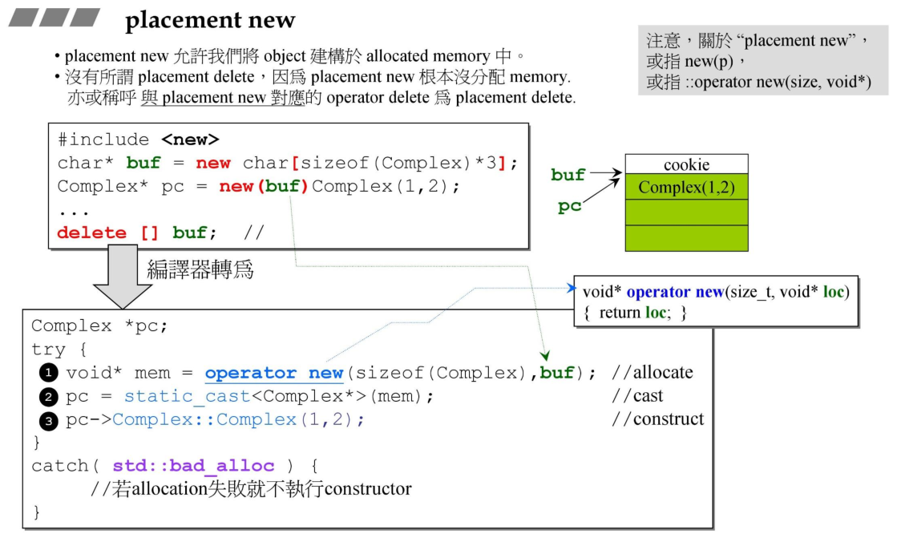

`char* buf = new char[sizeof(Complex) * 3];` 是在堆上申请一块能放 3 个 `Complex` 的原始字节空间；它本身创建的是 char 数组。

注意编译器转为的代码指的是 `Complex* pc` 这一行。`new (buf)` 中的 buf 是一个已经被分配好的内存空间地址。

- `new` 表达式：申请内存 + 调用构造函数，创建对象
- `operator new`：只申请原始内存
- `placement new`：不用申请内存，只在已有内存上构造对象

---

## 五、重载

### 1、C++ 内存分配的途径

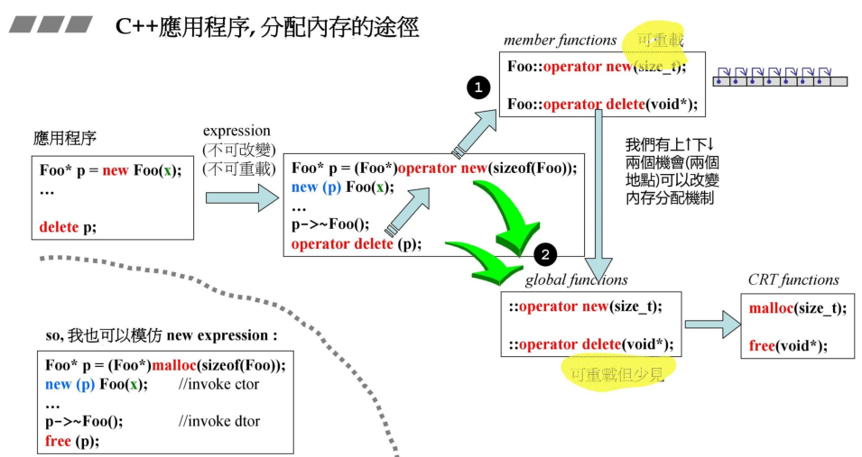

如果是正常情况下，调用 new 之后走的是第二条路线；如果在类中重载了 `operator new()`，那么走的是第一条路线，但最后还是要调用到系统的 `::operator new()` 函数，这在后续的例子中会体现。我们的目标就是走第一条路线，通过内存池来实现高效的内存管理。

全局的 `operator new/delete` 可以重载，也可以在类中重载 `operator new/delete`。

```cpp
Foo* p = new Foo(x); // 申请一块内存，然后调用 Foo 类的构造函数，并把 x 作为构造参数。
```

等价理解为：

```cpp
Foo* p = (Foo*)operator new(sizeof(Foo));  // 1. 先申请一块能放 Foo 对象的内存
new (p) Foo(x);                            // 2. 在这块内存上调用 Foo(x) 构造函数
```

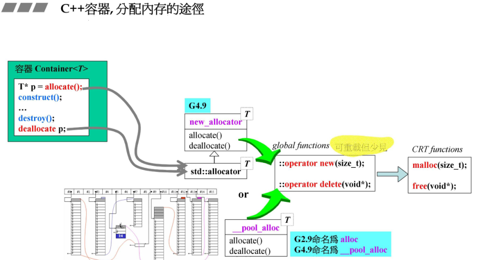

容器里面的 `construct` 和 `destroy` 是我们自己定义的函数，对标的是上一张图的 `new (p) Foo(x)` 和 `p->~Foo()`（调用构造函数和析构函数）。`allocate` 和 `deallocate` 这两个动作会被拉到 allocator 分配器上。

对于 GNU C，背后使用的 `allocate()` 函数最后也是调用了系统的 `::operator new()` 函数。

### 2、重载 new 和 delete

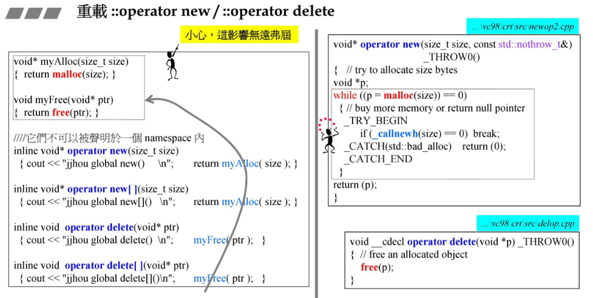

上面这张图演示了如何重载系统的 `operator new()` 函数，因为它对全局有影响，如果使用不当将造成很大的问题。

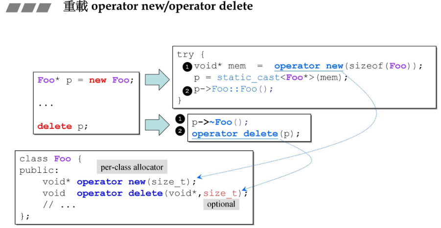

如果是在类中重载 `operator new()` 方法，那么该方法有 N 多种形式，但必须保证函数参数列表第一个参数是 `size_t` 类型变量；对于 `operator delete()`，第一个参数必须是 `void*` 类型，第二个 `size_t` 是可选项，可以去掉。`size_t` 参数不需要程序员自己传入，编译器会自动传入对象大小。

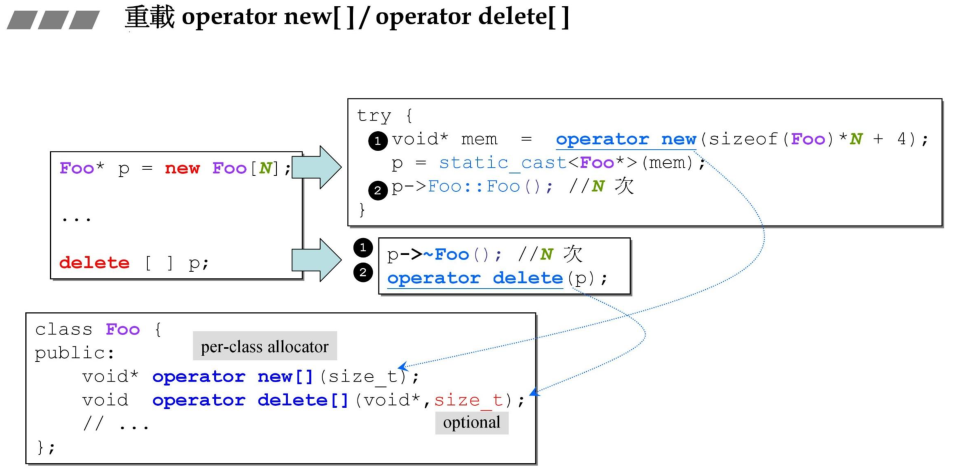

类中的 `operator new` 和 `delete` 这两个函数一般会在前面加 `static`，声明为静态函数。之所以这样做，因为类的静态函数无需创建对象就可以调用，直接使用 `类名::函数名` 来调用。调用 `operator new` 函数的时候对象还没有被创建，如果声明成一般的函数，只能通过对象名来调用，对象还没创建根本调不了；调用 `operator delete` 的时候，对象已经被析构了，因此也需要把 `operator delete` 声明成静态的。

![operator new[] / delete[] 的重载](attachments/primitives-21.png)

对于 `operator new[]` 和 `operator delete[]` 函数的重载，和前面类似。

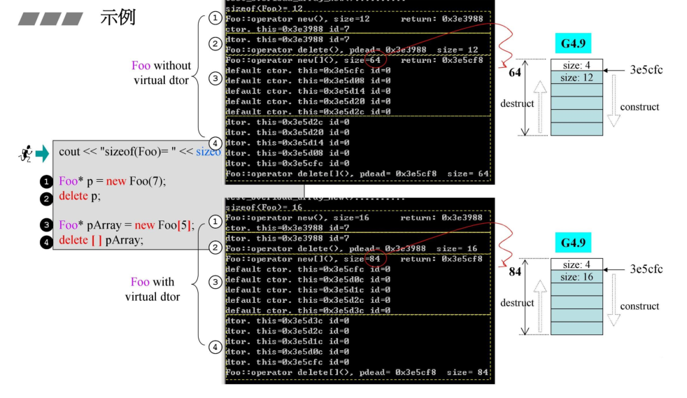

加虚函数的意义仅仅是改变了 Foo 的大小，没什么特殊含义。从图中可以看出，圈 1 的 new 执行了两个动作：分配内存和调用构造函数。

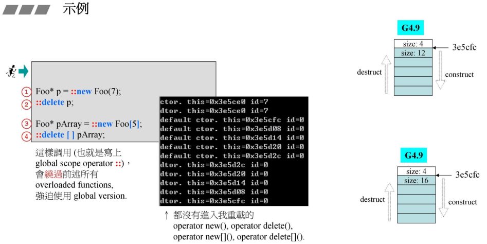

这页 PPT 是调用全局的 new 和 delete，不会进入我们在类中重载的 operator new/delete。

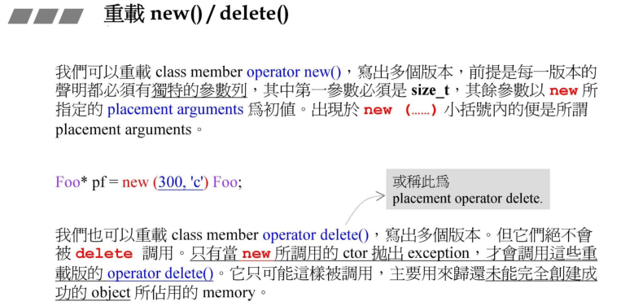

我们还可以重载 placement new/delete。`new()` 小括号里面的东西可以随意定义，不一定就是指针。但第一个参数必须是 `size_t`。

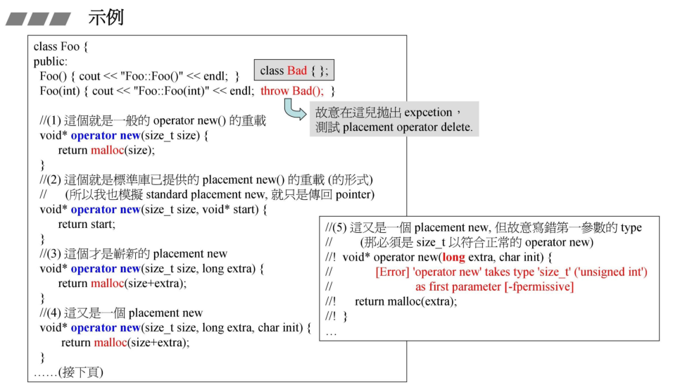

下图第 5 个语句调用的是 operator new 的第三个版本，分配好内存后，调用的 Foo 的第二个构造函数，我们故意在该构造函数中抛出异常。代表内存分配好了，但是对象没有正确创建，所以需要回收内存，会调用对应的 operator delete 重载版本。

`new (100) Foo` 实际上调用的 `operator new(sizeof(Foo), long extra);`，new 括号里面不需要指明 size，编译器会自动补。

`size_t` 参数始终存在，只不过它由编译器自动传入，你在 `new (...)` 括号里看到的参数，实际上都是 operator new 的第二个、第三个……参数。

另外还有件事情：

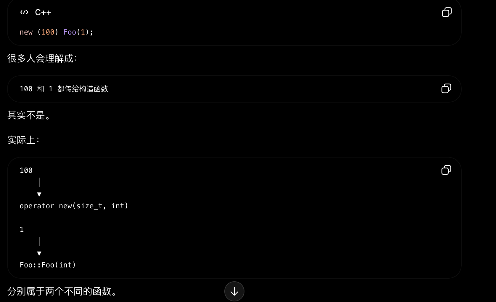

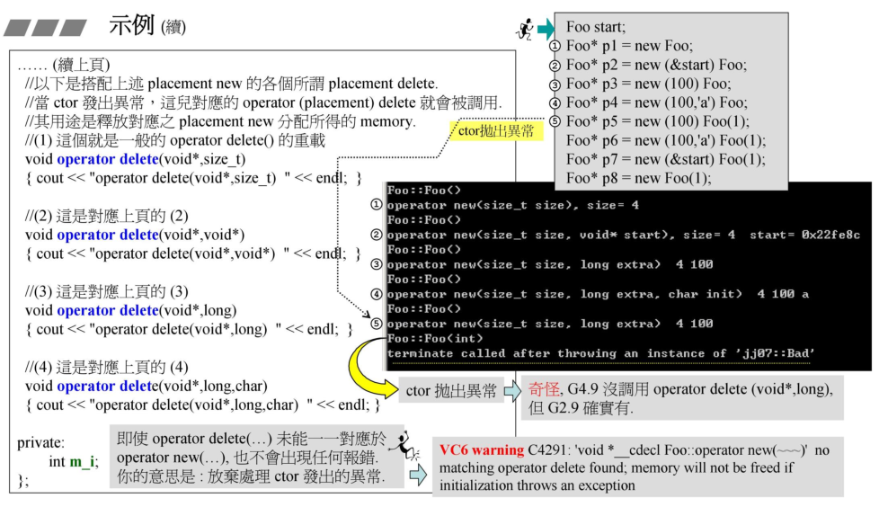

平时用到 string 就是标准库 `basic_string` 的 typedef 别名。

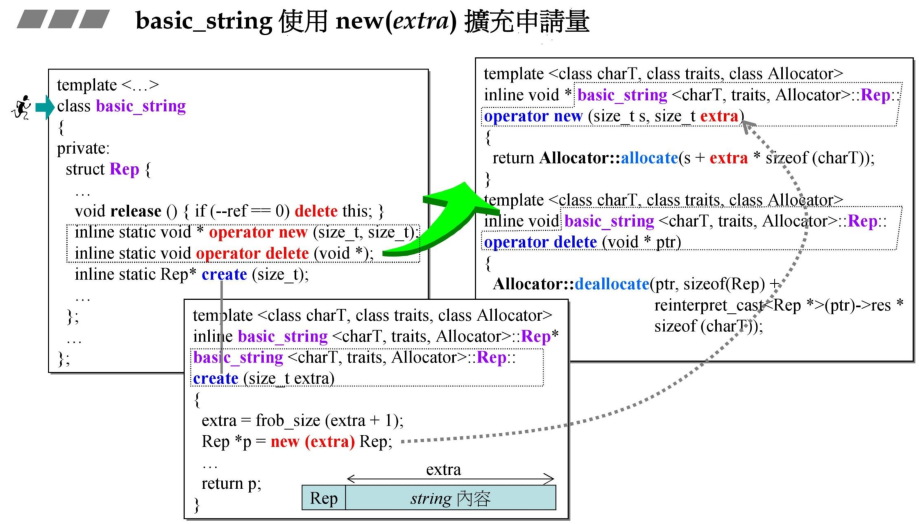

`basic_string` 类中重载了 placement new。

### 3、测试案例

**测试一：**

```cpp
#include <cstddef>
#include <iostream>
#include <string>
using namespace std;

namespace jj06
{

	class Foo
	{
	public:
		int _id;
		long _data;
		string _str;

	public:
		static void* operator new(size_t size);
		static void  operator delete(void* deadObject, size_t size);
		static void* operator new[](size_t size);
		static void  operator delete[](void* deadObject, size_t size);

		Foo() : _id(0)      { cout << "default ctor. this=" << this << " id=" << _id << endl; }
		Foo(int i) : _id(i) { cout << "ctor. this=" << this << " id=" << _id << endl; }
		//virtual
		~Foo()              { cout << "dtor. this=" << this << " id=" << _id << endl; }

		//不加 virtual dtor, sizeof = 12, new Foo[5] => operator new[]() 的 size 參數是 64,
		//加了 virtual dtor, sizeof = 16, new Foo[5] => operator new[]() 的 size 參數是 84,
		//上述二例，多出來的 4 可能就是個 size_t 欄位用來放置 array size.
	};

	void* Foo::operator new(size_t size)
	{
		Foo* p = (Foo*)malloc(size);
		cout << "Foo::operator new(), size=" << size << "\t  return: " << p << endl;

		return p;
	}

	void Foo::operator delete(void* pdead, size_t size)
	{
		cout << "Foo::operator delete(), pdead= " << pdead << "  size= " << size << endl;
		free(pdead);
	}

	void* Foo::operator new[](size_t size)
	{
		Foo* p = (Foo*)malloc(size);  //crash, 問題可能出在這兒
		cout << "Foo::operator new[](), size=" << size << "\t  return: " << p << endl;

		return p;
	}

	void Foo::operator delete[](void* pdead, size_t size)
	{
		cout << "Foo::operator delete[](), pdead= " << pdead << "  size= " << size << endl;

		free(pdead);
	}

	//-------------
	void test_overload_operator_new_and_array_new()
	{
		cout << "\ntest_overload_operator_new_and_array_new().......... \n";

		cout << "sizeof(Foo)= " << sizeof(Foo) << endl;

		{
			Foo* p = new Foo(7);
			delete p;

			Foo* pArray = new Foo[5];	//無法給 array elements 以 initializer
			delete[] pArray;
		}

		{
			cout << "testing global expression ::new and ::new[] \n";
			// 這會繞過 overloaded new(), delete(), new[](), delete[]()
			// 但當然 ctor, dtor 都會被正常呼叫.

			Foo* p = ::new Foo(7);
			::delete p;

			Foo* pArray = ::new Foo[5];
			::delete[] pArray;
		}
	}
} //namespace

int main(void)
{
	jj06::test_overload_operator_new_and_array_new();
	return 0;
}
```

编译运行结果如下：

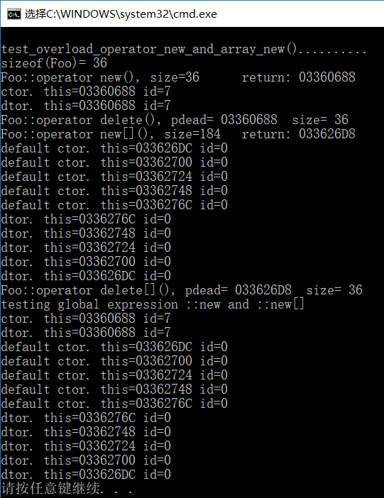

**测试二：**

```cpp
#include <vector>  //for test
#include <cstddef>
#include <iostream>
#include <string>
using namespace std;

namespace jj07
{

	class Bad { };
	class Foo
	{
	public:
		Foo() { cout << "Foo::Foo()" << endl; }
		Foo(int) {
			cout << "Foo::Foo(int)" << endl;
			// throw Bad();
		}

		//(1) 這個就是一般的 operator new() 的重載
		void* operator new(size_t size){
			cout << "operator new(size_t size), size= " << size << endl;
			return malloc(size);
		}

		//(2) 這個就是標準庫已經提供的 placement new() 的重載 (形式)
		//    (所以我也模擬 standard placement new 的動作, just return ptr)
		void* operator new(size_t size, void* start){
			cout << "operator new(size_t size, void* start), size= " << size << "  start= " << start << endl;
			return start;
		}

		//(3) 這個才是嶄新的 placement new
		void* operator new(size_t size, long extra){
			cout << "operator new(size_t size, long extra)  " << size << ' ' << extra << endl;
			return malloc(size + extra);
		}

		//(4) 這又是一個 placement new
		void* operator new(size_t size, long extra, char init){
			cout << "operator new(size_t size, long extra, char init)  " << size << ' ' << extra << ' ' << init << endl;
			return malloc(size + extra);
		}

		//(5) 這又是一個 placement new, 但故意寫錯第一參數的 type (它必須是 size_t 以滿足正常的 operator new)
		//!  	void* operator new(long extra, char init) { //[Error] 'operator new' takes type 'size_t' ('unsigned int') as first parameter [-fpermissive]
		//!	  	cout << "op-new(long,char)" << endl;
		//!    	return malloc(extra);
		//!  	}

		//以下是搭配上述 placement new 的各個 called placement delete.
		//當 ctor 發出異常，這兒對應的 operator (placement) delete 就會被喚起.
		//應該是要負責釋放其搭檔兄弟 (placement new) 分配所得的 memory.
		//(1) 這個就是一般的 operator delete() 的重載
		void operator delete(void*, size_t)
		{
			cout << "operator delete(void*,size_t)  " << endl;
		}

		//(2) 這是對應上述的 (2)
		void operator delete(void*, void*)
		{
			cout << "operator delete(void*,void*)  " << endl;
		}

		//(3) 這是對應上述的 (3)
		void operator delete(void*, long)
		{
			cout << "operator delete(void*,long)  " << endl;
		}

		//(4) 這是對應上述的 (4)
		//如果沒有一一對應, 也不會有任何編譯報錯
		void operator delete(void*, long, char)
		{
			cout << "operator delete(void*,long,char)  " << endl;
		}

	private:
		int m_i;
	};

	//-------------
	void test_overload_placement_new()
	{
		cout << "\n\n\ntest_overload_placement_new().......... \n";

		Foo start;  //Foo::Foo

		Foo* p1 = new Foo;           //op-new(size_t)
		Foo* p2 = new (&start) Foo;  //op-new(size_t,void*)
		Foo* p3 = new (100) Foo;     //op-new(size_t,long)
		Foo* p4 = new (100, 'a') Foo; //op-new(size_t,long,char)

		Foo* p5 = new (100) Foo(1);     //op-new(size_t,long)  op-del(void*,long)
		Foo* p6 = new (100, 'a') Foo(1); //
		Foo* p7 = new (&start) Foo(1);  //
		Foo* p8 = new Foo(1);           //
		//VC6 warning C4291: 'void *__cdecl Foo::operator new(unsigned int)'
		//no matching operator delete found; memory will not be freed if
		//initialization throws an exception
	}
} //namespace

int main(void)
{
	jj07::test_overload_placement_new();
	return 0;
}
```

编译运行结果如下：

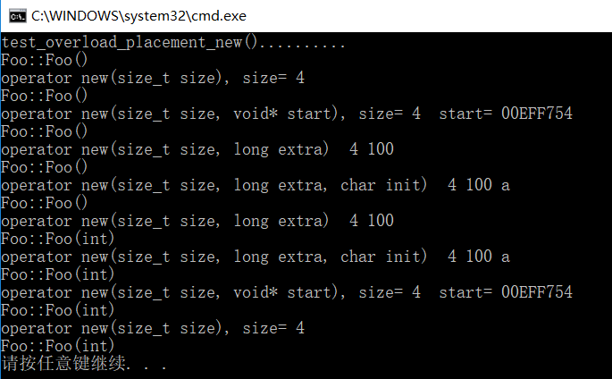

接下来会讲针对一个 class 来写出它的内存管理。所谓内存管理，就是用 malloc 拿到一块很大的内存（即内存池），把大内存切分成很多小内存，用链表来管理小内存。使用者需要的时候就能很快地给它，而不是每次用的时候现调 malloc。这样可以减少调用 malloc 的次数。

除了减少 malloc 次数，我们还想减少 cookie 的用量。一次 malloc 会得到 2 个 cookie，也就是八字节。

---

## 五、pre-class allocator

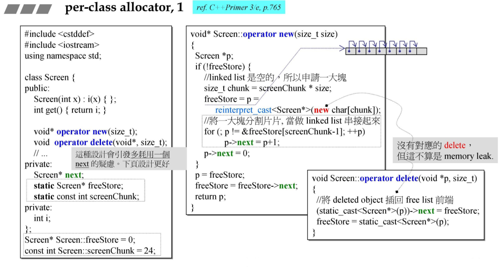

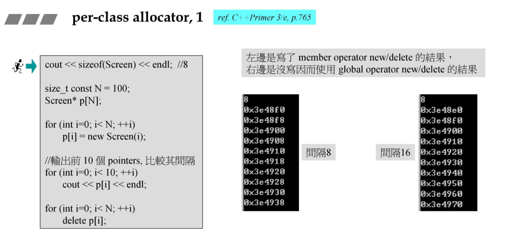

案例如下：

```cpp
#include <cstddef>
#include <iostream>
using namespace std;

namespace jj04
{
	//ref. C++Primer 3/e, p.765
	//per-class allocator

	class Screen {
	public:
		Screen(int x) : i(x) { };
		int get() { return i; }

		void* operator new(size_t);
		void  operator delete(void*, size_t);	//(2)
		//! void  operator delete(void*);			//(1) 二擇一. 若(1)(2)並存,會有很奇怪的報錯 (摸不著頭緒)

	private:
		Screen* next;
		static Screen* freeStore;
		static const int screenChunk;
	private:
		int i;
	};
	Screen* Screen::freeStore = 0;
	const int Screen::screenChunk = 24;

	void* Screen::operator new(size_t size)
	{
		Screen *p;
		if (!freeStore) {
			//linked list 是空的，所以攫取一大塊 memory
			//以下呼叫的是 global operator new
			size_t chunk = screenChunk * size;
			freeStore = p =
				reinterpret_cast<Screen*>(new char[chunk]);
			//將分配得來的一大塊 memory 當做 linked list 般小塊小塊串接起來
			for (; p != &freeStore[screenChunk - 1]; ++p)
				p->next = p + 1;
			p->next = 0;
		}
		p = freeStore;
		freeStore = freeStore->next;
		return p;
	}
	//! void Screen::operator delete(void *p)		//(1)
		void Screen::operator delete(void *p, size_t)	//(2)二擇一
		{
			//將 deleted object 收回插入 free list 前端
			(static_cast<Screen*>(p))->next = freeStore;
			freeStore = static_cast<Screen*>(p);
		}
		//-------------
	void test_per_class_allocator_1()
	{
		cout << "\ntest_per_class_allocator_1().......... \n";

		cout << sizeof(Screen) << endl;		//8

		size_t const N = 100;
		Screen* p[N];

		for (int i = 0; i< N; ++i)
			p[i] = new Screen(i);

		//輸出前 10 個 pointers, 用以比較其間隔
		for (int i = 0; i< 10; ++i)
			cout << p[i] << endl;

		for (int i = 0; i< N; ++i)
			delete p[i];
	}
} //namespace

int main(void)
{
	jj04::test_per_class_allocator_1();
	return 0;
}
```

编译运行结果如下：

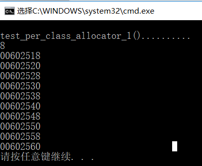

每个对象以 8 byte 对齐。内存池本质上是分配了一大块内存，然后将该内存分割为多个小块通过链表拼接起来，所以物理上不一定连续但是逻辑上是连续的。

第二个版本解决了第一版存在 next 指针的问题。

`AirplaneRep` 结构体有两个成员，大小是五个字节。由于内存对齐，所以变成 8 个字节。union 联合体可以理解成一个东西从不同的角度去看：一个角度是 `AirplaneRep` 结构体（八个字节）；一个角度是指针，由于指针是四个字节，所以指针只能看到这个东西的前 4 个字节。这个指针被称为嵌入式指针（embedded pointer）。当这个 Airplane 对象正在被使用时，内存被解释为 `AirplaneRep rep`；当这个对象被释放、放回内存池时，内存被解释为 `Airplane* next`。

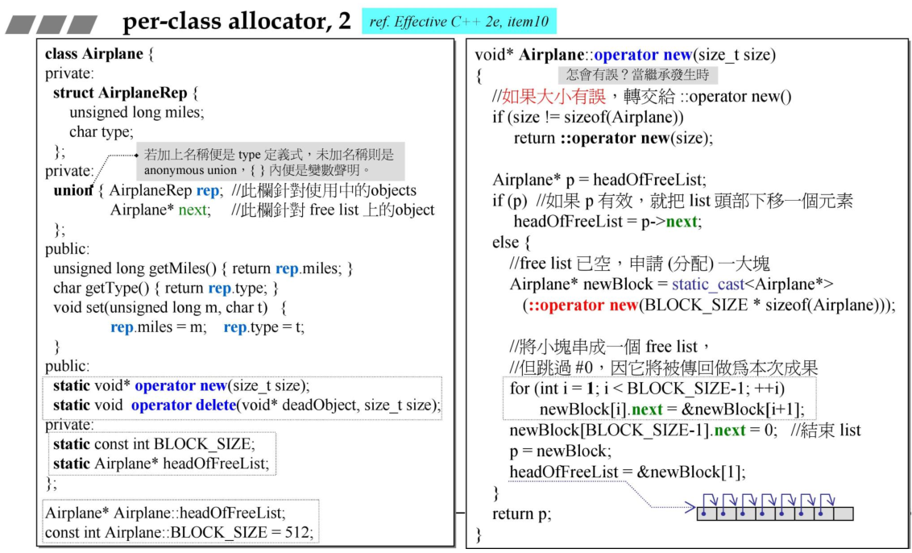

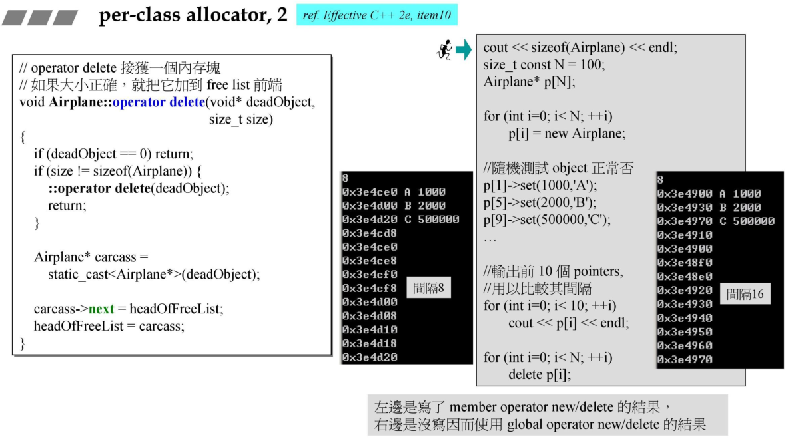

`BLOCK_SIZE` 是类的静态变量（所有类实例共享唯一的静态成员变量。例如，可以用它来记录某个类的实例总数，或者统计某项全局资源的消耗状态，一旦在某个对象中修改，其他对象均能同步看到结果），用来表示每次批量申请多少个 Airplane 单元。`headOfFreeList` 指向当前空闲链表的第一个节点。

静态成员需要在类中声明、类外定义。没有显式赋值的话，默认是 0。

来看 operator new 的内部。首先有个 if 判断，size 是编译器传进来的，为什么会出错？当继承发生的时候可能会出错，但这不是我们讨论的重点，之后再说。现在就假设 size 一定是正确的。如果内存池中还有空闲块，就将头指针往后移一位。如果内存池没有空闲块了，就一次性申请 512 个对象大小的空间，将这些空闲块串起来，i 要从 1 开始，因为第一块 `newBlock[0]` 需要被返回作为本次 `new Airplane` 的返回结果。

为什么要用指针把这些空闲块串起来，直接用 `newBlock[i]` 访问不行吗？如果只分配不释放的话是可以的，但释放的时候可能按 `newBlock[2] -> newBlock[3] -> newBlock[1]` 这样的顺序释放，那么空闲位置就不是连续的了，就不能用数组下标来访问了。

案例如下：

```cpp
#include <cstddef>
#include <iostream>
using namespace std;

namespace jj05
{
	//ref. Effective C++ 2e, item10
	//per-class allocator

	class Airplane {   //支援 customized memory management
	private:
		struct AirplaneRep {
			unsigned long miles;
			char type;
		};
	private:
		union {
			AirplaneRep rep;  //此針對 used object
			Airplane* next;   //此針對 free list
		};
	public:
		unsigned long getMiles() { return rep.miles; }
		char getType() { return rep.type; }
		void set(unsigned long m, char t)
		{
			rep.miles = m;
			rep.type = t;
		}
	public:
		static void* operator new(size_t size);
		static void  operator delete(void* deadObject, size_t size);
	private:
		static const int BLOCK_SIZE;
		static Airplane* headOfFreeList;
	};

	Airplane* Airplane::headOfFreeList;
	const int Airplane::BLOCK_SIZE = 512;

	void* Airplane::operator new(size_t size)
	{
		//如果大小錯誤，轉交給 ::operator new()
		if (size != sizeof(Airplane))
		return ::operator new(size);

		Airplane* p = headOfFreeList;

		//如果 p 有效，就把list頭部移往下一個元素
		if (p)
			headOfFreeList = p->next;
		else {
			//free list 已空。配置一塊夠大記憶體，
			//令足夠容納 BLOCK_SIZE 個 Airplanes
			Airplane* newBlock = static_cast<Airplane*>
				(::operator new(BLOCK_SIZE * sizeof(Airplane)));
			//組成一個新的 free list：將小區塊串在一起，但跳過
			//#0 元素，因為要將它傳回給呼叫者。
			for (int i = 1; i < BLOCK_SIZE - 1; ++i)
				newBlock[i].next = &newBlock[i + 1];
			newBlock[BLOCK_SIZE - 1].next = 0; //以null結束

			// 將 p 設至頭部，將 headOfFreeList 設至
			// 下一個可被運用的小區塊。
			p = newBlock;
			headOfFreeList = &newBlock[1];
		}
		return p;
	}

	// operator delete 接獲一塊記憶體。
	// 如果它的大小正確，就把它加到 free list 的前端
	void Airplane::operator delete(void* deadObject,
		size_t size)
	{
		if (deadObject == 0) return;
		if (size != sizeof(Airplane)) {
			::operator delete(deadObject);
			return;
		}

		Airplane *carcass =
			static_cast<Airplane*>(deadObject);

		carcass->next = headOfFreeList;
		headOfFreeList = carcass;
	}

	//-------------
	void test_per_class_allocator_2()
	{
		cout << "\ntest_per_class_allocator_2().......... \n";

		cout << sizeof(Airplane) << endl;    //8

		size_t const N = 100;
		Airplane* p[N];

		for (int i = 0; i< N; ++i)
			p[i] = new Airplane;
			//隨機測試 object 正常否
			p[1]->set(1000, 'A');
			p[5]->set(2000, 'B');
			p[9]->set(500000, 'C');
			cout << p[1] << ' ' << p[1]->getType() << ' ' << p[1]->getMiles() << endl;
			cout << p[5] << ' ' << p[5]->getType() << ' ' << p[5]->getMiles() << endl;
			cout << p[9] << ' ' << p[9]->getType() << ' ' << p[9]->getMiles() << endl;
					//輸出前 10 個 pointers, 用以比較其間隔
		for (int i = 0; i< 10; ++i)
			cout << p[i] << endl;

		for (int i = 0; i< N; ++i)
			delete p[i];
	}
} //namespace

int main(void)
{
	jj05::test_per_class_allocator_2();
	return 0;
}
```

编译运行结果如下：

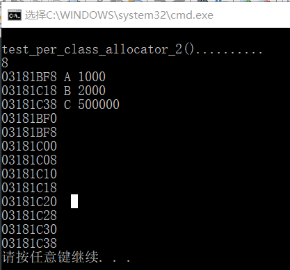

这种做法有几点比较有意思：首先是使用了 union 保存链表元素的 next 指针，这样整体上可以节省空间；其次是 delete 函数，它并没有直接将目标元素删除，而是将它当作下一个可分配的内存空间，也就是说如果 delete 某元素，那么该元素占有的内存空间不会被 free 掉（不会被还给操作系统，这是这个内存池的一个缺点），而是在下一次调用 new 时分配给新的对象。

---

## 六、static allocator

把前面的 pre-class 分配器的逻辑抽出来，集中在一个名叫 allocator 类中。把前面「Airplane 类自己维护内存池」的做法，抽取成一个通用的小型内存分配器 allocator。

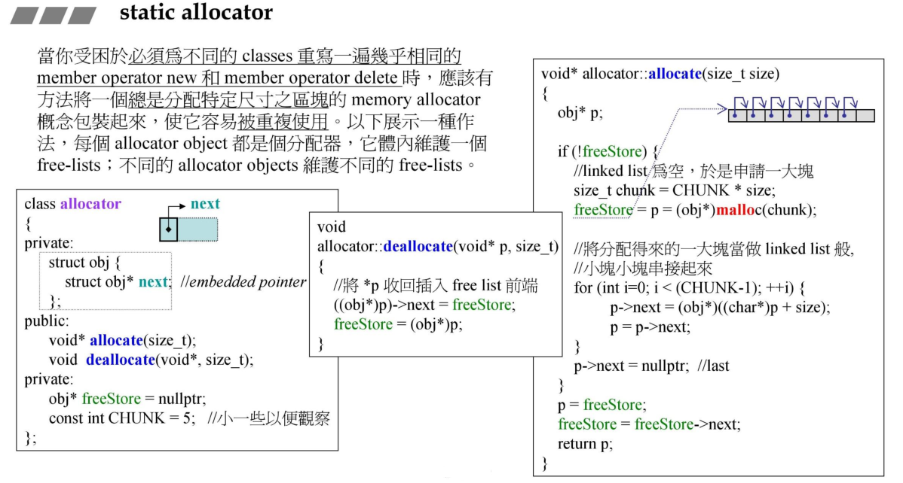

```cpp
// 把分配得到的一个个内存块串成一个链表。
for (int i = 0; i < CHUNK - 1; ++i) {
    p->next = (obj*)((char*)p + size); // 指针加法运算，要看指针是什么类型。如果是 char 类型（1 个字节），p+1 就是和 p 紧挨的内存单元。
    p = p->next;
}
```

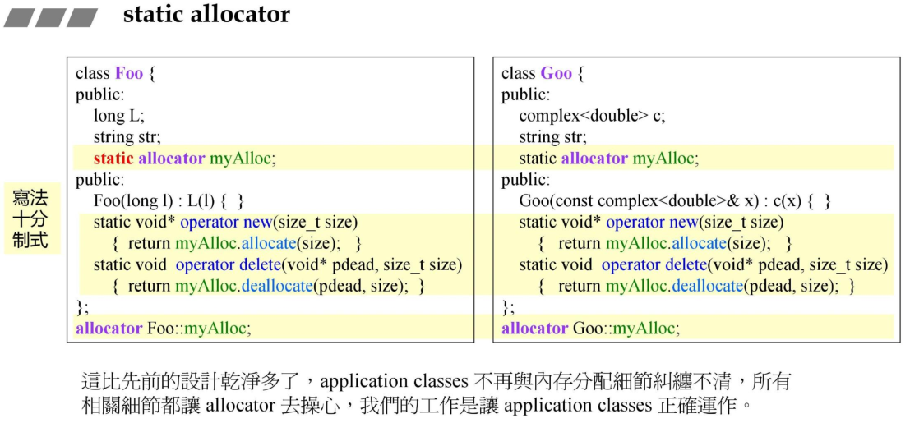

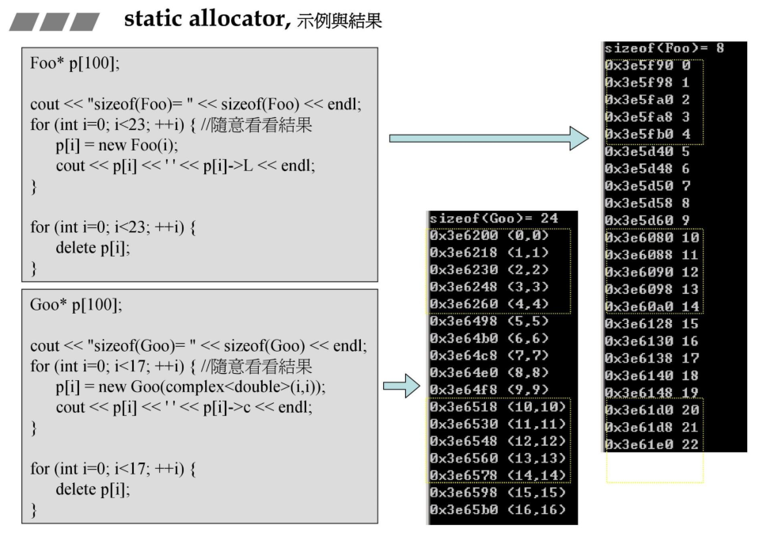

代码如下：

```cpp
#include <cstddef>
#include <iostream>
#include <complex>
using namespace std;

namespace jj09
{

	class allocator
	{
	private:
		struct obj {
			struct obj* next;  //embedded pointer
		};
	public:
		void* allocate(size_t);
		void  deallocate(void*, size_t);
		void  check();

	private:
		obj* freeStore = nullptr;
		const int CHUNK = 5; //小一點方便觀察
	};

	void* allocator::allocate(size_t size)
	{
		obj* p;

		if (!freeStore) {
			//linked list 是空的，所以攫取一大塊 memory
			size_t chunk = CHUNK * size;
			freeStore = p = (obj*)malloc(chunk);

			//cout << "empty. malloc: " << chunk << "  " << p << endl;

			//將分配得來的一大塊當做 linked list 般小塊小塊串接起來
			for (int i = 0; i < (CHUNK - 1); ++i)	{  //沒寫很漂亮, 不是重點無所謂.
				p->next = (obj*)((char*)p + size);
				p = p->next;
			}
			p->next = nullptr;  //last
		}
		p = freeStore;
		freeStore = freeStore->next;

		//cout << "p= " << p << "  freeStore= " << freeStore << endl;

		return p;
	}
	void allocator::deallocate(void* p, size_t)
	{
		//將 deleted object 收回插入 free list 前端
		((obj*)p)->next = freeStore;
		freeStore = (obj*)p;
	}
	void allocator::check()
	{
		obj* p = freeStore;
		int count = 0;

		while (p) {
			cout << p << endl;
			p = p->next;
			count++;
		}
		cout << count << endl;
	}
	//--------------

	class Foo {
	public:
		long L;
		string str;
		static allocator myAlloc;
	public:
		Foo(long l) : L(l) {  }
		static void* operator new(size_t size)
		{ return myAlloc.allocate(size); }
		static void  operator delete(void* pdead, size_t size)
		{
			return myAlloc.deallocate(pdead, size);
		}
	};
	allocator Foo::myAlloc;
	class Goo {
		public:
			complex<double> c;
			string str;
			static allocator myAlloc;
		public:
			Goo(const complex<double>& x) : c(x) {  }
			static void* operator new(size_t size)
			{ return myAlloc.allocate(size); }
			static void  operator delete(void* pdead, size_t size)
			{
				return myAlloc.deallocate(pdead, size);
			}
		};
		allocator Goo::myAlloc;
			//-------------
	void test_static_allocator_3()
	{
		cout << "\n\n\ntest_static_allocator().......... \n";

		{
			Foo* p[100];

			cout << "sizeof(Foo)= " << sizeof(Foo) << endl;
			for (int i = 0; i<23; ++i) {	//23,任意數, 隨意看看結果
				p[i] = new Foo(i);
				cout << p[i] << ' ' << p[i]->L << endl;
			}
			//Foo::myAlloc.check();

			for (int i = 0; i<23; ++i) {
				delete p[i];
			}
			//Foo::myAlloc.check();
		}

		{
			Goo* p[100];

			cout << "sizeof(Goo)= " << sizeof(Goo) << endl;
			for (int i = 0; i<17; ++i) {	//17,任意數, 隨意看看結果
				p[i] = new Goo(complex<double>(i, i));
				cout << p[i] << ' ' << p[i]->c << endl;
			}
			//Goo::myAlloc.check();

			for (int i = 0; i<17; ++i) {
				delete p[i];
			}
			//Goo::myAlloc.check();
		}
	}
} //namespace

int main(void)
{
	jj09::test_static_allocator_3();
	return 0;
}
```

编译运行结果如下：

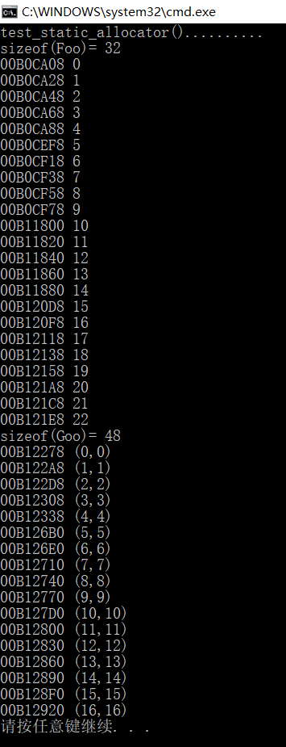

之前的几个版本都是在类的内部重载了 `operator new()` 和 `operator delete()` 函数，这些版本都将分配内存的工作放在这些函数中，但现在的这个版本将这些分配内存的操作放在了 allocator 类中，这就渐渐接近了标准库的方法。从上面的代码中可以看到，两个类 Foo 和 Goo 中 `operator new()` 和 `operator delete()` 函数等很多部分代码类似，于是可以使用宏 macro 来将这些高度相似的代码提取出来，简化类的内部结构，但最后达到的结果是一样的：

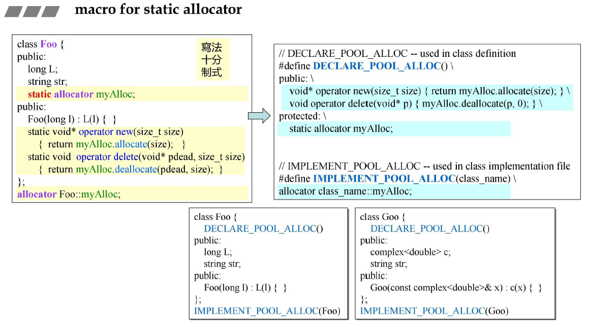

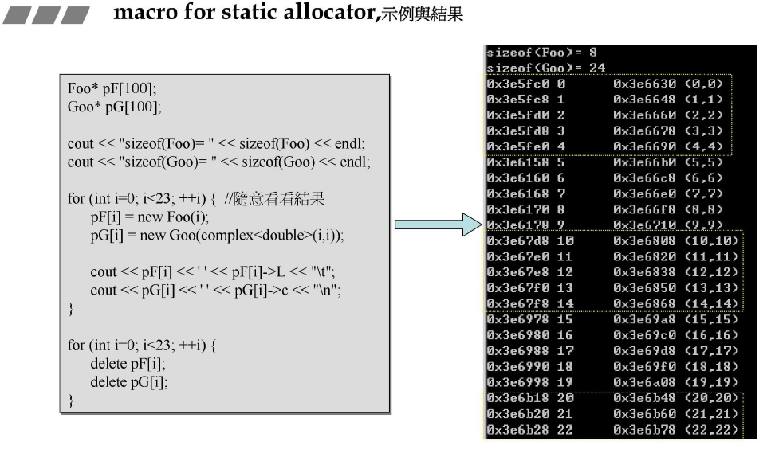

对宏不是太熟悉，解释一下：调用宏就会把宏里面的内容原封不动地展开。为什么每行最后都有一个斜杠？宏如果跨多行书写的话，每行末尾要加反斜杠。`DECLARE_POOL_ALLOC()` 加括号代表是函数式宏。

为什么把 `myAlloc` 设置为 protected？因为内存池对象只允许当前类及其派生类访问，不希望普通外部代码随便碰它。

为什么右边没写 static？因为 operator new/delete 一定是静态成员函数，不显式声明，也会按照静态成员的方式工作。

---

## 七、global allocator

上面我们自己定义的分配器使用了一条链表来管理内存，但标准库却用了多条链表来管理，这在后续会详细介绍：

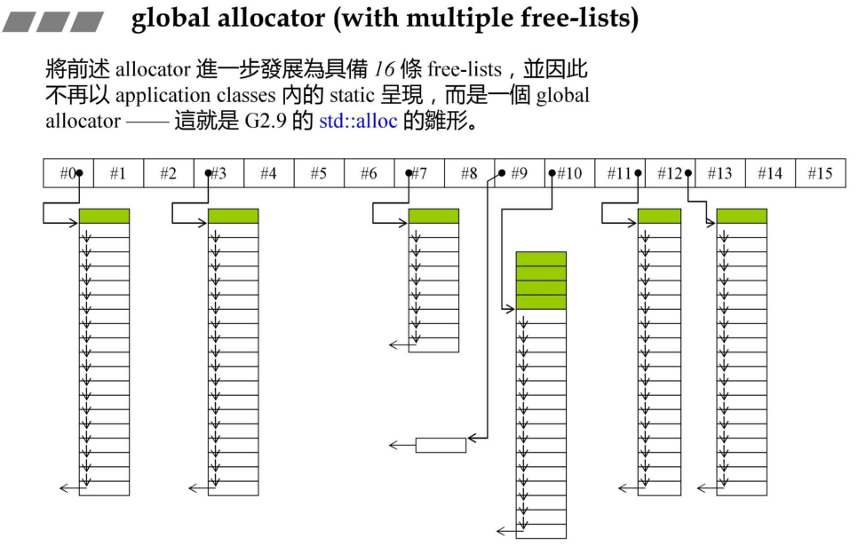

---

## 八、new handler

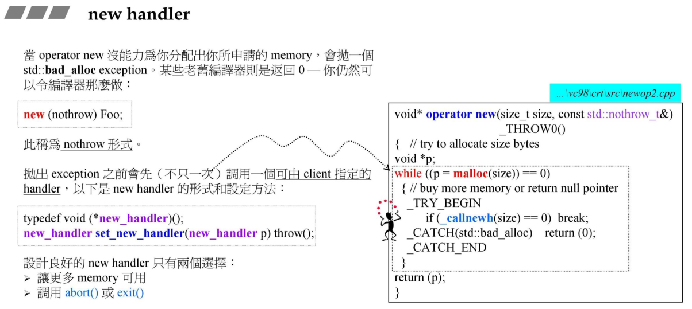

如果用户调用 new 申请一块内存，由于系统原因或者申请内存过大导致申请失败，这时将抛出异常，在一些老的编译器中可能会直接返回 0。但抛出异常之前，会先检查有没有注册 `new_handler` 函数，如果有就先调用它。

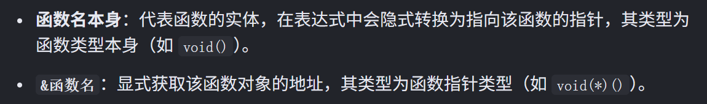

```cpp
typedef void (*new_handler)();  // new_handler 前面有个 * 代表 new_handler 是指针。
// 定义了一个函数指针 new_handler，指向返回值为 void、参数列表为空的函数。
new_handler set_new_handler(new_handler p) throw(); // 注册内存分配失败处理函数，throw() 表示该函数不会抛出异常。
// 为什么返回 new_handler？假设先前注册了函数 A，现在又注册函数 B，那么先前的函数 A 就会被当作返回值返回。
```

从右图看，当无法分配内存时，`operator new()` 函数内部将调用 `_callnewh()` 函数，这个函数是个中间调用者，它会去调用已经注册的 new_handler 函数。new handler 一般有两个选择：让更多的 Memory 可用，或者直接 `abort()` 或 `exit()`。下面是测试的一个结果：

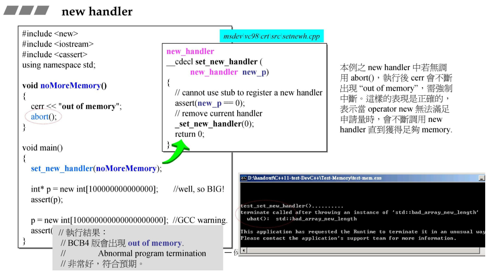

该部分中自定义了处理函数 `noMoreMemory()` 并通过 `set_new_handler` 来注册该处理函数，在 BCB4 编译器中会调用到自定义的 `noMoreMemory()` 函数，但在右边的 dev c++ 中却没有调用，这个还要看平台。

---

## 九、=default 和 =delete

`default`：我需要这个函数，请编译器按照语言规定生成默认版本。`delete`：这个函数我不要。

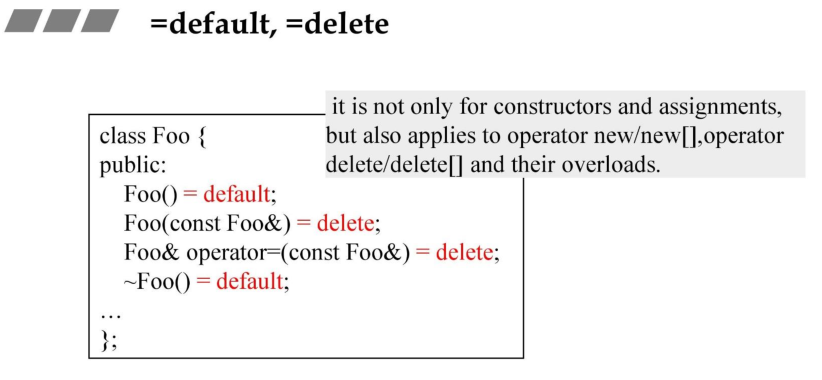

`operator new/delete` 没有默认的版本。

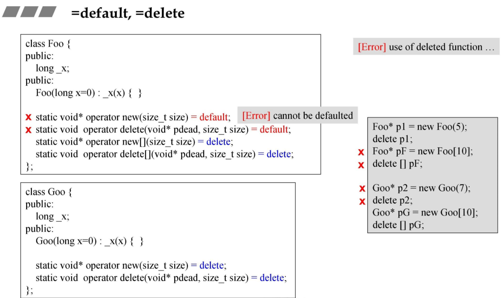

更加详细的内容可以参考下面这篇文章：
https://blog.csdn.net/u012333003/article/details/25299939

---

> 下一篇：第二讲 std::allocator
