# C++ 内存管理 · 第三讲 malloc/free（VC6 内存分配）

> 来源：[xubenshan.github.io — 第三讲 malloc/free](https://xubenshan.github.io/blog/cpp/C__%E5%86%85%E5%AD%98%E7%AE%A1%E7%90%86/%E7%AC%AC%E4%B8%89%E8%AE%B2malloc_free.html)
> 作者：小熊 | 2026/7/19

本讲通过分析 VC6 在调用 `main()` 之前的初始化行为，来剖析 VC6 的内存管理机制，重点是 SBH（Small Block Heap，小区块堆）对小内存块的「分段管理」。

---

## VC6 内存分配

通过 VC6 调用 main 函数之前的初始化行为来分析 VC6 的内存管理。

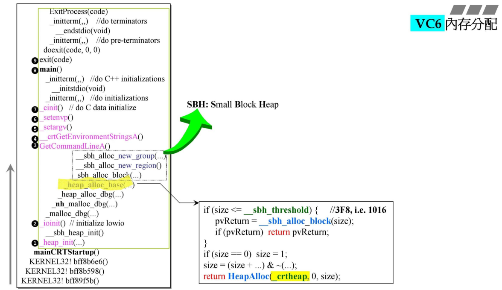

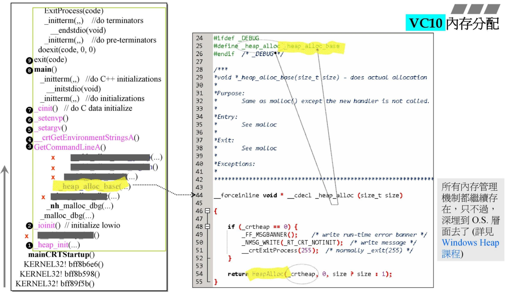

下图是函数调用栈，在调用 main 函数之前还会调用很多函数。重点看 `_heap_alloc_base` 函数，这个函数内部判断了 size 的大小，当 size 小于 1016 的时候调用 `_sbh_alloc_block` 函数。大于时调用 windows 操作系统提供的 HeapAlloc 函数。也就是说 VC6 和第二章的分配器一样，都是为小区块服务的。大区块就直接交给操作系统进行处理。

在 vc10 底下，仍然有 `_heap_alloc_base` 函数，但函数内部不管 size 多大，都会调用 HeapAlloc 函数。也就是说 vc10 没有提供专门处理小区块的机制，但是操作系统 HeapAlloc 函数中提供了。

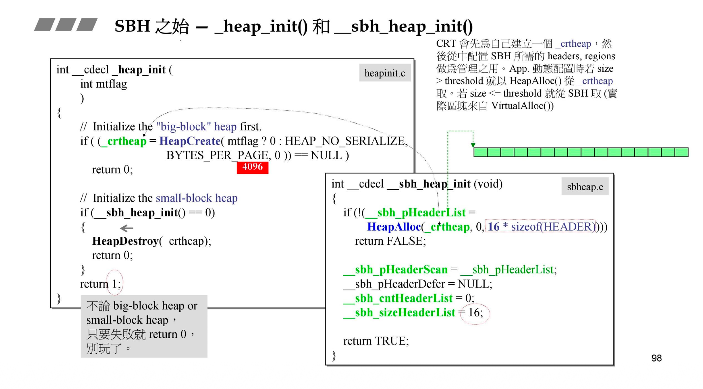

来看 heap_init 函数，内部通过 HeapCreate 向操作系统要一块堆内存，大小是 4096，这块内存名字叫 `_crtheap`。然后 `_sbh_heap_init` 函数内部调用 HeapAlloc 函数，从上面拿到的 `_crtheap` 堆内存中要 16 个 HEADER 大小的内存，得到指针。这就是 heap_init 的内容。

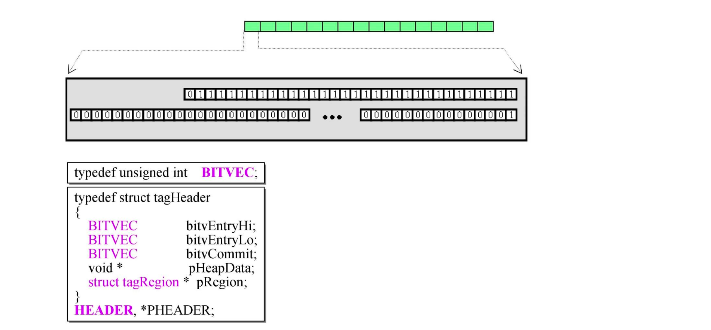

下图就是 HEADER 的结构。

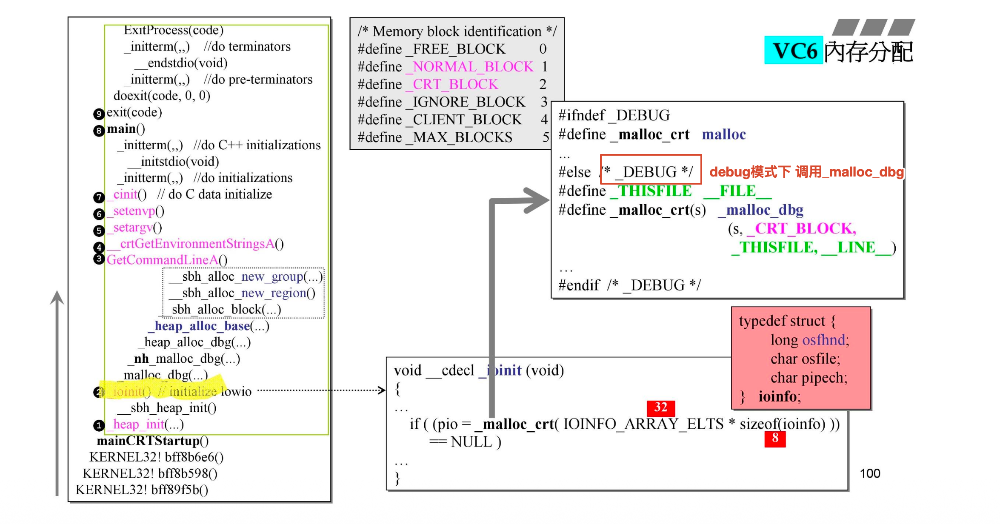

接下来看 ioinit 函数，函数内部调用了 malloc_crt，（这是第一次内存分配）在 debug 模式下，就是调用 malloc_dbg。和 malloc 区别就是多了些参数。

分配了 32 个 ioinfo 大小的内存，ioinfo 有三个成员，大小是 6 个字节，内存对齐到 8 个字节。总共 256 个字节，16 进制就是 100。

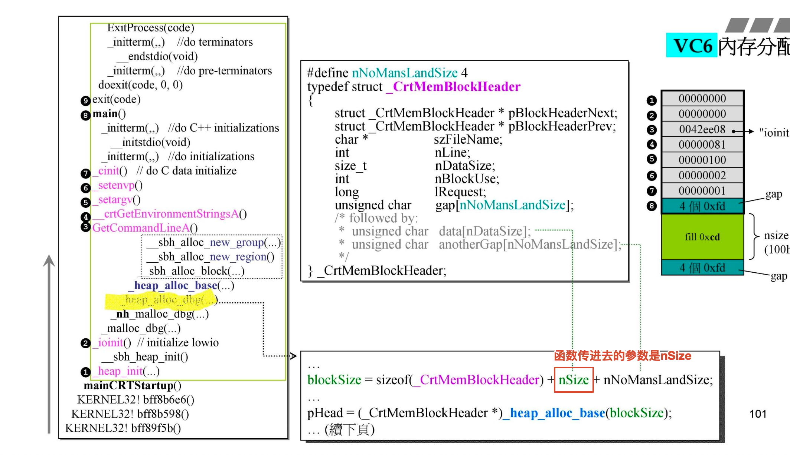

在 malloc_dbg 中调用 `_nh_malloc_dbg`，在该函数内部又会调用 heap_alloc_dbg 函数，传入的参数是 nSize。就是上面的 256 个字节。函数内部会把 256 字节进行扩充，添加进去 debug header，变成 blockSize 大小，然后再把 blocksize 传进 heap_alloc_base 函数。

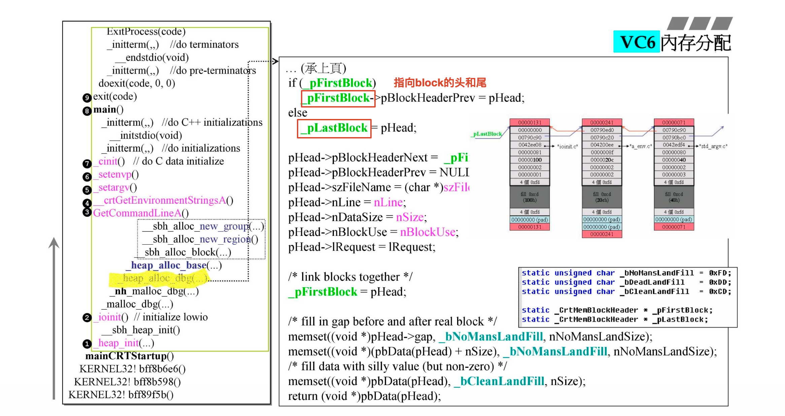

下图有两个指针指向第一块和最后一块。最后面的代码表明在 block 中会 memset 填入一些值。

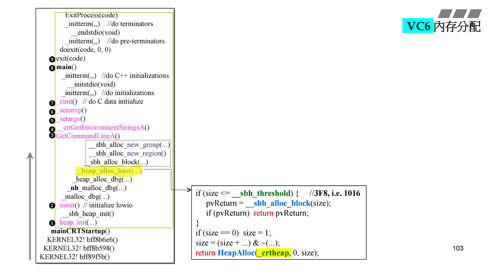

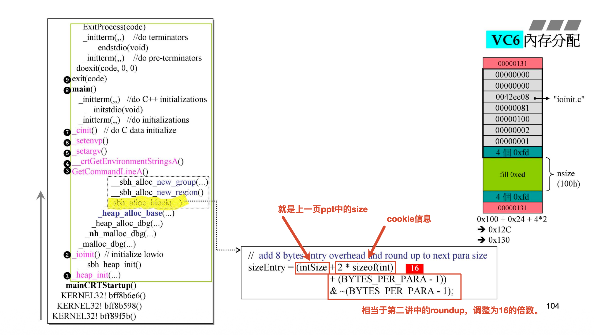

为什么会出现 1016 这个奇怪的数字？因为在 heap_alloc_base 的时候 block 还没有加入 cookie，加入 cookie 后不能超过 1024，才叫做小区块，才为它提供服务，那不加 cookie 之前门限就是 1016 了。

cookie 的内容是 131h，这个在之前我们说过原因了，虽然块大小最终是 130，但是 16 倍数，最后四位肯定是 0，那就拿最后一位表示该块有没有被分配出去，因为这个块马上就要分配出去了，所以最后一位为 1。当回收给 SBH 的时候，就会设置为 0，cookie 的内容就是 130h 了。

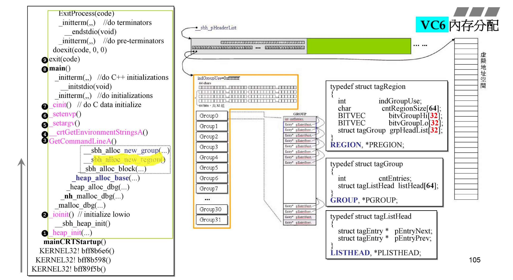

接下来看 new_region 函数：这个时候才真正的要分配内存了，前面都是在调整大小。一个 header 会去申请真正的内存，为了对这块内存做管理，header 会有一个指针指向 region，region 里面有 group，group 里面有 64 组指针（每组指针管理一条独立的链表，为什么要用两个指针来管理一个链表呢，为了实现双向链表。设置个哨兵节点，节点 Next 指向链表头、Prev 指向链表尾。）。还有 bitvGroupHi、 bitvGroupLo。Hi 和 Lo 会拼接在一起，元素是 unsigned int，也就是 4 个字节，拼在一起 8 个字节，64bit，共 32 个组。这个 region 大概 16KB。

group 中有 64 组指针，64 是怎么算出来的？

VC6 SBH 以 16 字节作为一个最小尺寸单位，源码称为一个 paragraph：

```cpp
#define BYTES_PER_PARA 16
```

SBH 能处理的最大用户数据尺寸是：

```cpp
#define MAX_ALLOC_DATA_SIZE 0x3f8  // 1016 字节
```

每个 block 还需要前、后两个 4 字节大小 cookie，共 8 字节：

```cpp
#define MAX_ALLOC_ENTRY_SIZE \
    (MAX_ALLOC_DATA_SIZE + 0x8)
```

因此最大 SBH block 总长度为：

```text
0x3f8 + 0x8 = 0x400
1016  + 8   = 1024 字节
```

将 1024 字节按照每档 16 字节分类：

```text
1024 ÷ 16 = 64
```

所以需要 64 个尺寸等级。

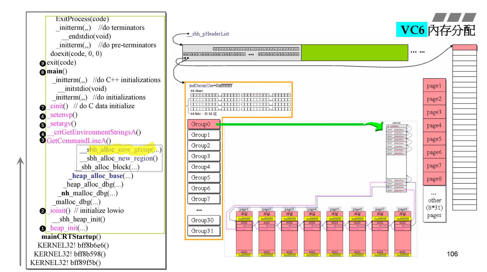

现在 SBH 手上有了 1MB 的内存，如何进行管理呢？看下面的图，虚拟地址空间的大小是 1MB，会将这个空间划分为 32 组，每组的大小是 32KB。每个 Group 管理 32 KB，又可看成 8 个 4 KB 的 page。page 之间通过指针串起来，把这 8 个 page 挂到最后一个链表上。

前面说的 1MB 是虚拟地址空间，SBH 真正向操作系统要内存的时候，要的并不是 1MB，而是 8 个 page。这 8 个 page 在虚拟内存中是连续的。但是在物理内存中不一定连续。在操作系统中学过页式内存管理，连续的虚拟页会映射到离散的物理页框。

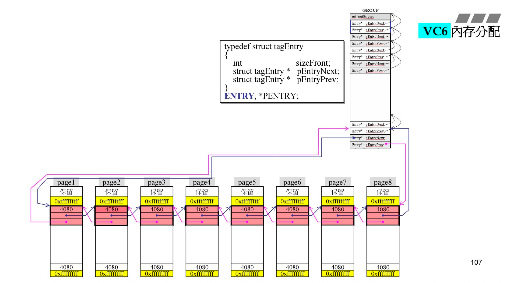

接下来把图片放大，再详细看下这个 page。page 里面的 4080 指的是两个黄色块之间的大小（block 的大小）。整个 page 是 4kB，也就是 4096B，黄色大小是 2*4B，剩下是 4088B。但是会被调整为 16 的倍数，这就是图上保留块的意义。黄色夹的块大小调整为 4080，保留块大小是 8 个字节。每个 block 上下都会带 cookie，4080 包含 cookie 的 8 个字节。

每个 Page 两端有：0xffffffff。这个值会被当作「已占用的边界标记」，这个值在后面 free 的时候会有作用。

group 中有 64 组指针，也就是 128 个指针，指针指向 Entry 结构体，这个结构体里面有三个东西，其中两个指针，指向的是结构体本身。可以仔细看下图中蓝色线的指向，体会一下。

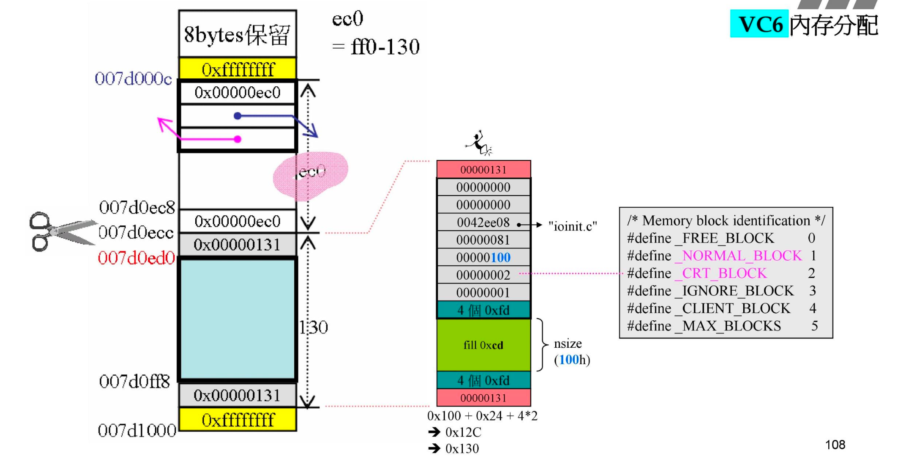

block 中有 64 组指针，每组指针管理一个链表。链表区块大小是多少？第一个链表是 16，第二个是 32，依次类推，第 64 个就是 1024。但是从上图我们看到最后一组指针管理的区块大小明明是 4080，接近 4K。这是为什么？这就是 VC6 底下的独特的设计，最后一个链表管理大于 1k 的区块。

下面这个图是对 block 做切分（把 page 中原来一个 4080 字节的大空闲 block，重新划分成「剩余空闲块」和「本次已分配块」两个相邻 block。）。Io_init 申请 256 个字节，也就是 100h。加上 cookie 和 debug header，再调到 16 的边界最后是 130h。4080 对应的是 ff0，相减剩下的是 ec0。alloc_new_group 返回红色的地址，函数一层层返回，最后 io_init 返回的是绿色内存的地址。也就是实际 100h 内存所在的地址。

---

## SBH 行为分析

### 首次分配

这张图描述的是 CRT 已完成 SBH 基础初始化后，第一次出现符合 SBH 条件的小块申请时，SBH 创建首个 Region、提交首个 Group、初始化 8 个 Page，并从其中一个空闲块切分出申请块的过程。

HeapAlloc (`_crtheap`, 16 * sizeof (HEADER)) 申请了可容纳 16 个 HEADER 的管理数组，这属于 SBH 初始化。

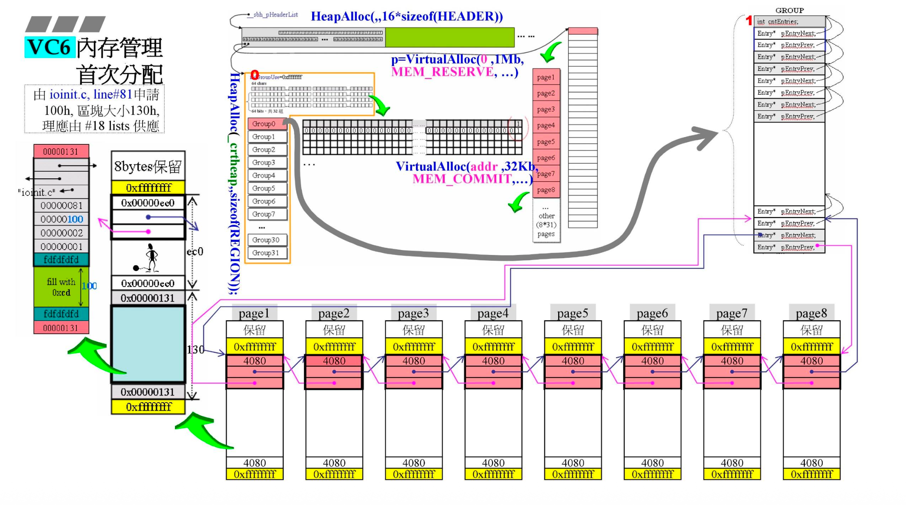

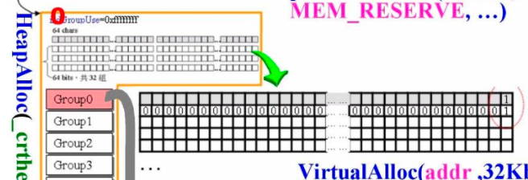

把 region 单独拿出来，里面有 64 个 bits，每位代表每组指针的状态，是否挂着 free_list。开始的时候只有最后一组指针挂着 free_list，所以只有最后一位是 0。灰色的块是 64 个 chars，最后一位也设置为 1。

### N 次分配

接下来看第二次分配（CRT 中的 getenvironmentstrings 函数发出的请求），请求的内存再加上 debug header，cookies，再调整到 16 的边界，最后是 240h。首先要判断 240h 需要第几号链表提供服务，（转换成 10 进制，除以 16，再减 1）由于通过看 64bits，只有最后一位是 1，表明此时只有最后一组指针挂着 free_list，所以只能对最后一个链表的 page 做切分，过程和第一次分配是一样的。

group 中的 int 整数 cntEntries，记录当前 Group 中尚未释放的「已分配 block」数量。当该数为 0 时，代表整个 32 KB Group 内已经没有任何用户正在使用的 block。就可以回收给操作系统了。

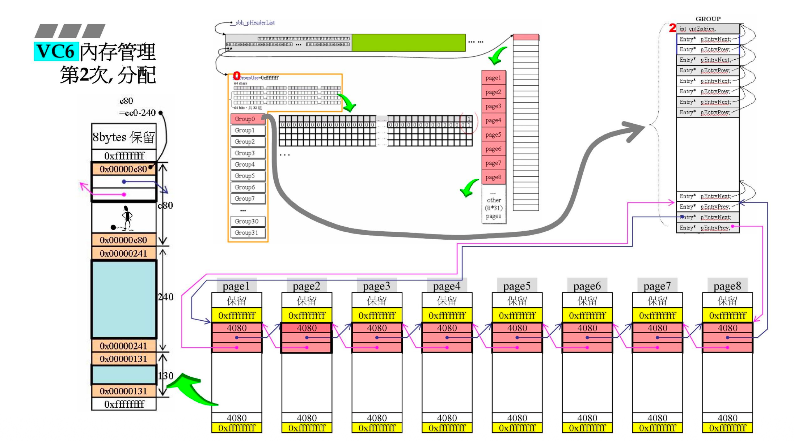

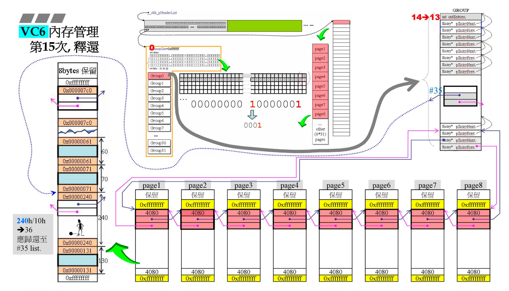

前面讲的都是 malloc，接下来讲 free。cntEntries-1。释放的是第二次 malloc 的内存。大小是 240h，应该被第 35 组指针管理，所以就将第 35 组 next 指针指向该 block。该 block 也会有两个指针（同样是嵌入式指针），指向 next 和 prev。由于 #35 中 free_list 只有这一个块，所以：

```cpp
listHead[35].pEntryNext = block;
listHead[35].pEntryPrev = block;

block->pEntryNext = &listHead[35];
block->pEntryPrev = &listHead[35];
```

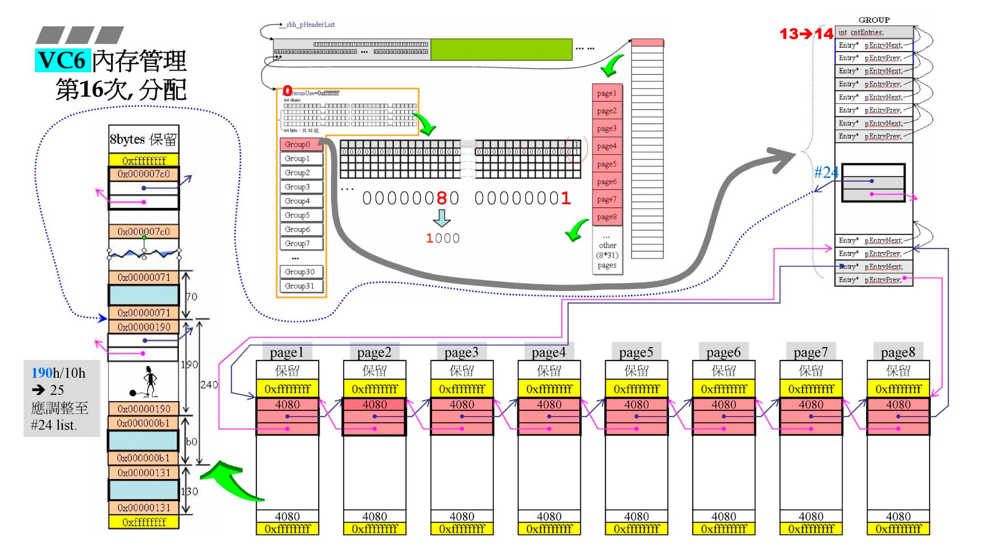

接下来进行分配，大小是 b0。理应由第 B0/10h-1 条链表提供服务，但该链表是空的，所以只能由第 35 条链表来提供服务。第 35 条链表有一个区块，大小是 240h，做切分，切分出 b0，剩余 190h。190h 这个区块需要被调整到第 24 条链表。

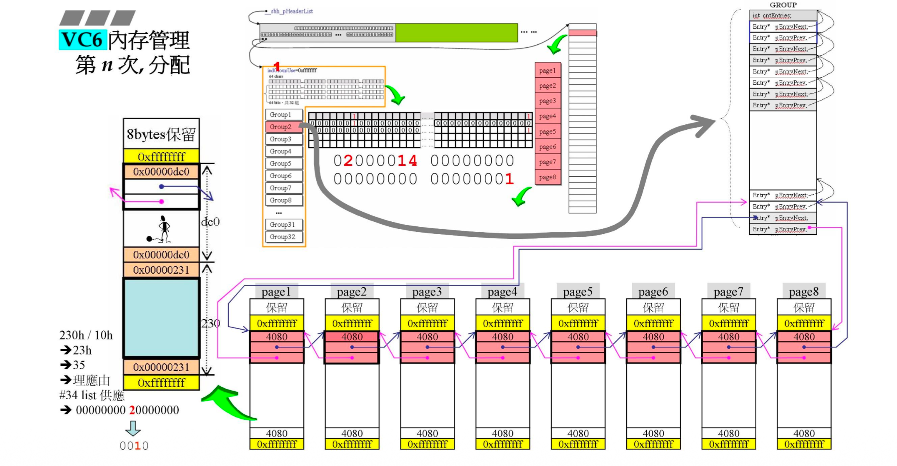

为什么用第二组 group 了？因为第一组 group 不能满足这次的需求了，为啥呢，从 02000014 中看出哪些链表上面是有区块的，这些区块太小了不能满足本次需求，所以需要用第二组 group 了。

### 区块合并

释放的区块是可以被合并的。合并之后再去判断应该把合并后的 block 挂到哪条链表下。如果没有下 cookie 这个设计，就没办法往上合并。这就解释了为什么每个 block 上下都要有 cookie。

先找到当前 block 的上 cookie：

```text
pEntry
↓
┌──────────────────┐
│ sizeFront        │ 4 字节，上 cookie
├──────────────────┤
│ pvAlloc          │ ← SBH 返回的地址
│ ...              │
├──────────────────┤
│ sizeBack         │ 4 字节，下 cookie
└──────────────────┘
```

释放的时候只需要拿到 pvAlloc 后向前移动 4 字节，就找到了当前 block 的上 cookie，用上 cookie 找到当前 block 的下 cookie，也就找到了下一个 block 的上 cookie，进而得出下一个 block 是否空闲。pvAlloc 后向上移动 8 字节，就能找到上一个 block 的下 cookie。

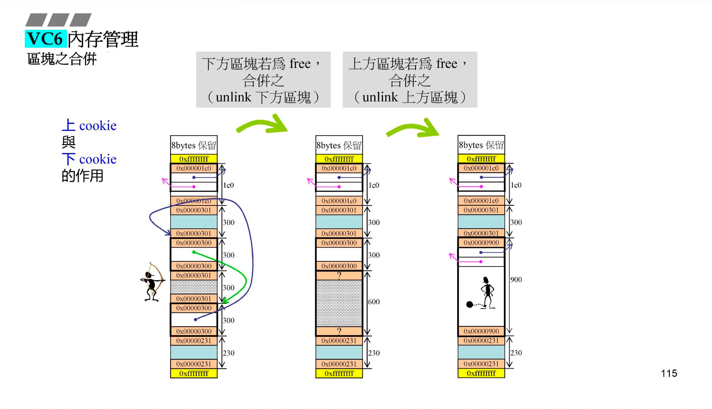

以 malloc(0x100) 为例，梳理下 malloc 的流程：

```text
低地址
┌──────────────────────────┐
│ SBH sizeFront            │ ← pEntry，SBH 上 cookie
├──────────────────────────┤
│ _CrtMemBlockHeader       │ ← pHead / SBH 返回给上层的地址
│   next、prev             │
│   文件名、行号           │
│   用户数据大小           │
│   block 类型、序号       │
│   前保护区 0xFDFDFDFD    │
├──────────────────────────┤
│ 用户真正可用的数据       │ ← pUserData，malloc 最终返回值
│                          │
├──────────────────────────┤
│ 后保护区 0xFDFDFDFD      │
├──────────────────────────┤
│ SBH 对齐产生的剩余空间   │
├──────────────────────────┤
│ SBH sizeBack             │ ← SBH 下 cookie
└──────────────────────────┘
高地址
```

Debug Heap 向基础堆申请：

```text
用户数据                  0x100
Debug 信息和前后保护区    0x024
--------------------------------
基础堆申请大小            0x124
```

SBH 再加上自己的两个 cookie：

```text
基础堆所需区域            0x124
SBH 上 cookie             0x004
SBH 下 cookie             0x004
--------------------------------
                          0x12C
按 16 字节对齐          → 0x130
```

所以 SBH 管理的是一个 0x130 的 block，但其中真正由应用程序使用的只有 0x100：

```text
0x130 SBH block
├─ 8 字节 SBH cookie
├─ 0x24 字节 Debug 开销
├─ 0x100 字节用户数据
└─ 4 字节对齐余量
```

释放时也要分两层回退。

应用程序调用：

```cpp
free(pUserData);
```

首先由 Debug Heap 根据 pUserData 向前找到：

```cpp
pHead = pHdr(pUserData);
```

检查 Debug Header 和前后 0xFD 保护区后，再把 pHead 交给基础堆。SBH 收到 pHead 后，才继续向前减 4 字节寻找自己的上 cookie：

```cpp
pEntry = (char *)pHead - sizeof(int);
```

### VC6 free

如何找到 p 在哪个 header？sbh_pHeaderList 指向 header 数组，很容易找到每个 header 指向（header 中有个指针，指向虚拟地址空间）的虚拟地址空间，进而确定 p 落在哪个 header 中。如何找到落在哪个 group 中？p 减去虚拟地址空间首地址，然后除以 32，就得到了 group。如果找到 free_list？通过 p 找到 block 的上 cookie，就得到了 block 的大小，除以 16-1，就得到了需要回收到第几号链表。

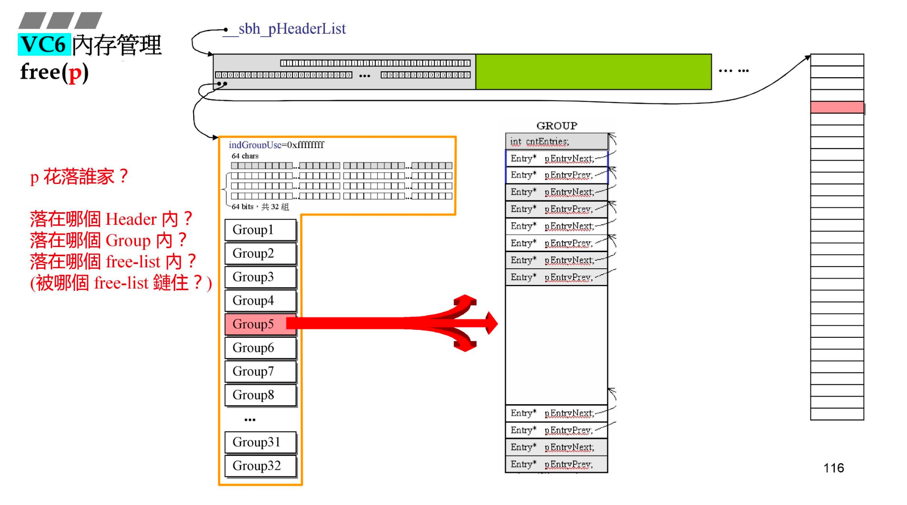

### 总结

vc6 内存管理总结：

分段管理。把 1MB 的内存划分为 32 块，一个 group 管理一块。再把每块继续细分成 8 个 page。每个 group 管理 8 个 page。

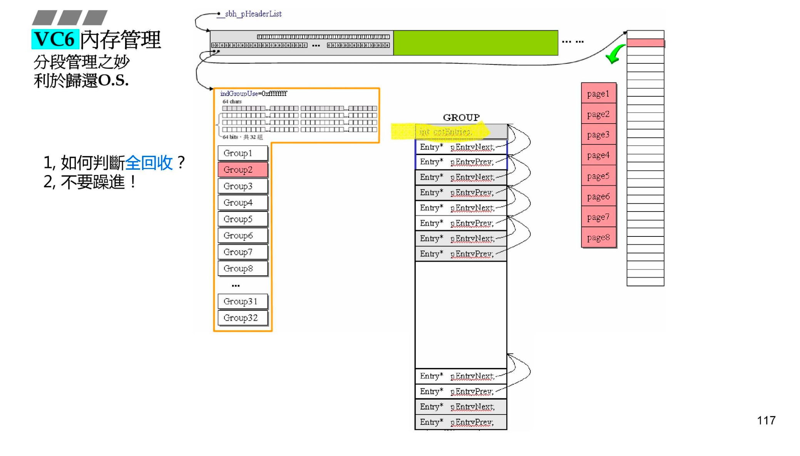

分段管理的好处：

全回收指的是把 group 对应的 8 个 page 归还给操作系统。如何判断能否全回收？前面也提到过就是判断 cntEntries == 0。

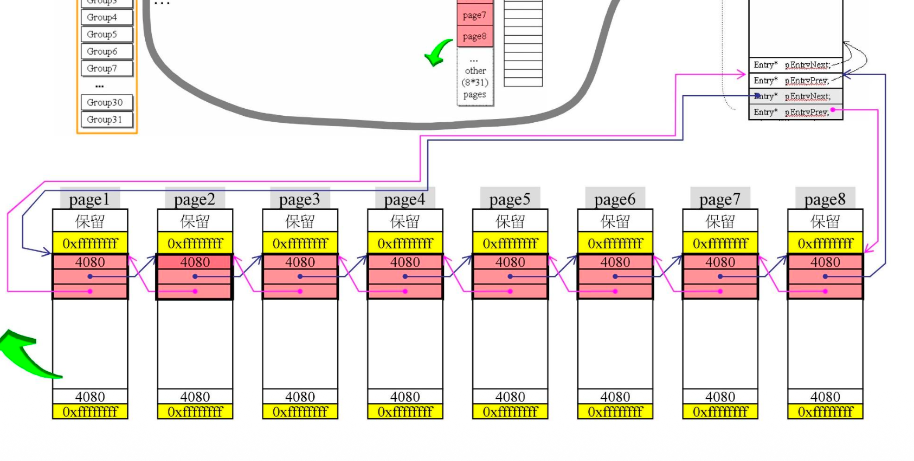

全回收状态就是初始状态。当 cntEntries == 0，SBH 不会着急把内存还给操作系统，会等下一次又出现全回收，才会把上一次的内存还给操作系统。

全回收状态为什么就是初始状态。因为 SBH 的释放操作会不断把地址相邻的空闲 block 合并。当一个 Group 中所有已分配 block 都被释放后，每个 Page 内最终只可能剩下一个最大的空闲 block，于是逻辑布局重新回到刚初始化时的样子。

比如某个快照中 page 的状态：`[剩余空闲][已分配 A][空闲 B][已分配 C]`，当释放 A 后，会变成 `[空闲][已分配 C]`，释放 C 后，`[空闲]`。

为什么 8 个 page 不会合并成一整块，因为黄色块 0xffffffff 会被当作「已占用的边界标记」，合并到 page 边缘就停止了。所以一个 Group 全部释放后，不会形成一个 32 KB 的大空闲块，而是恢复成：8 个 Page✖️4KB。

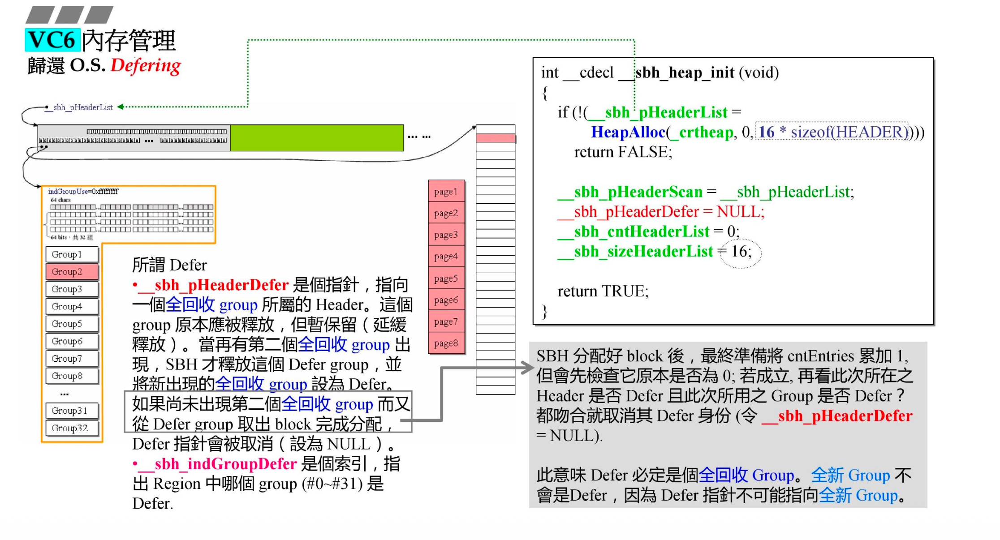

延缓全回收动作：

---

## 大局观整理

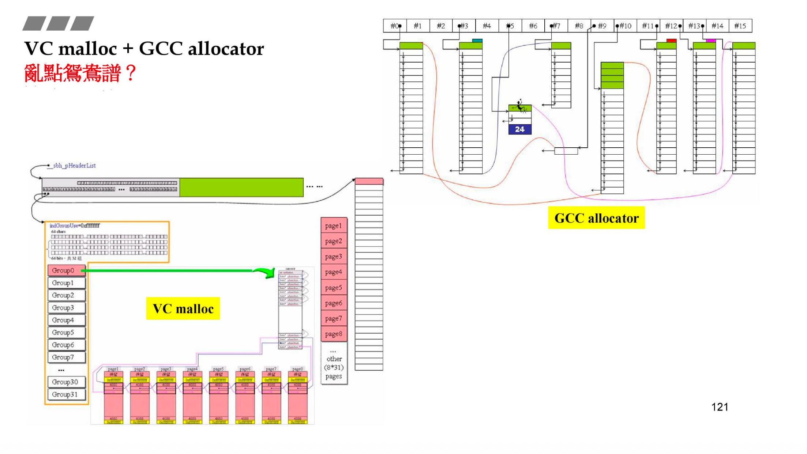

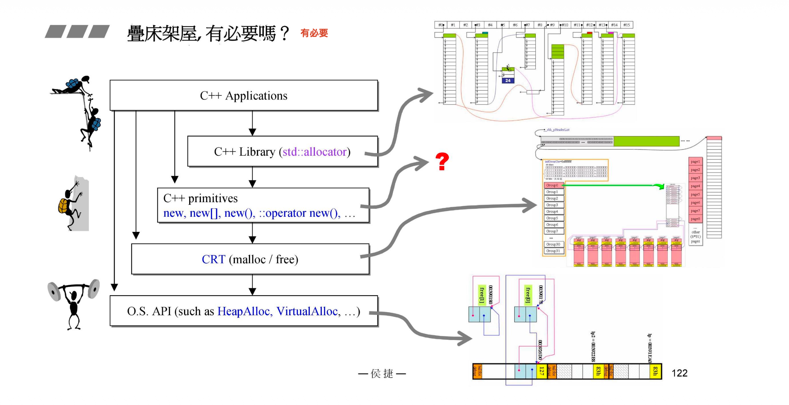

---

> 上一篇：第二讲 std::allocator　|　下一篇：第四讲 Loki allocator
