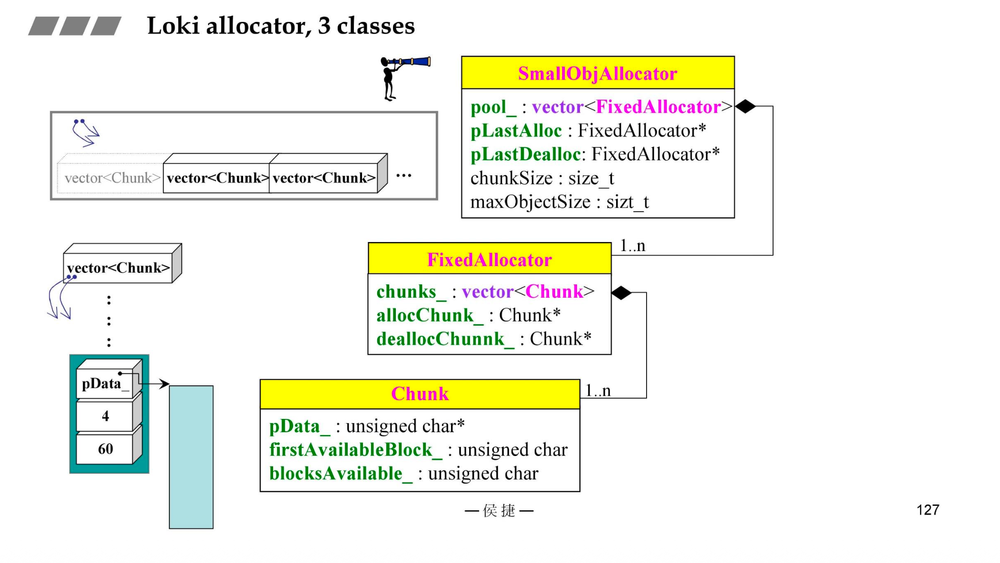
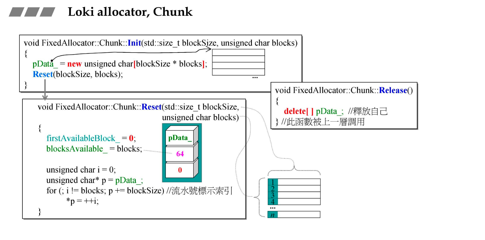
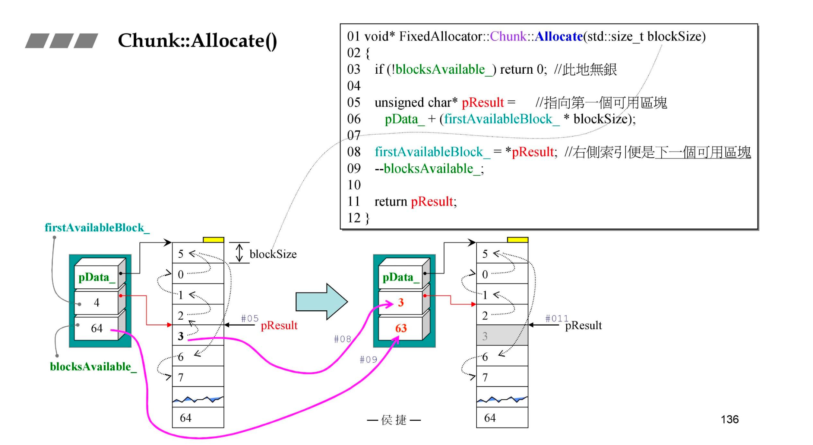
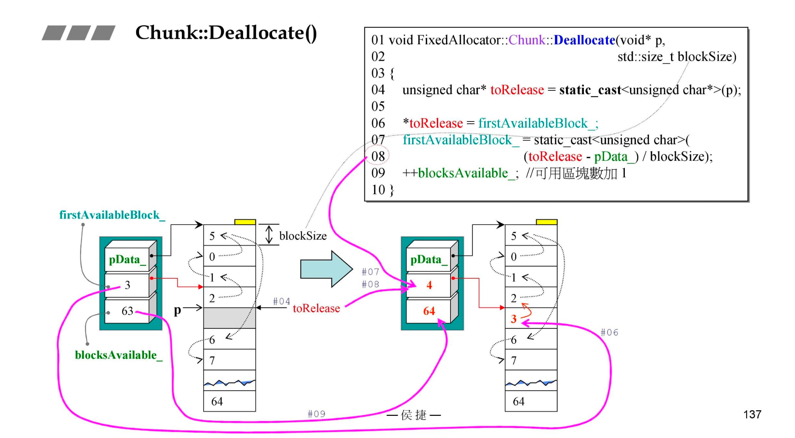
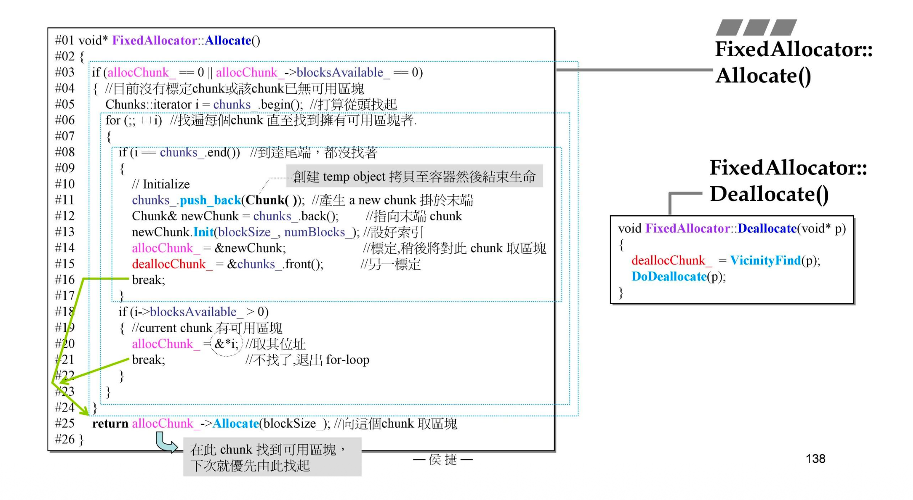
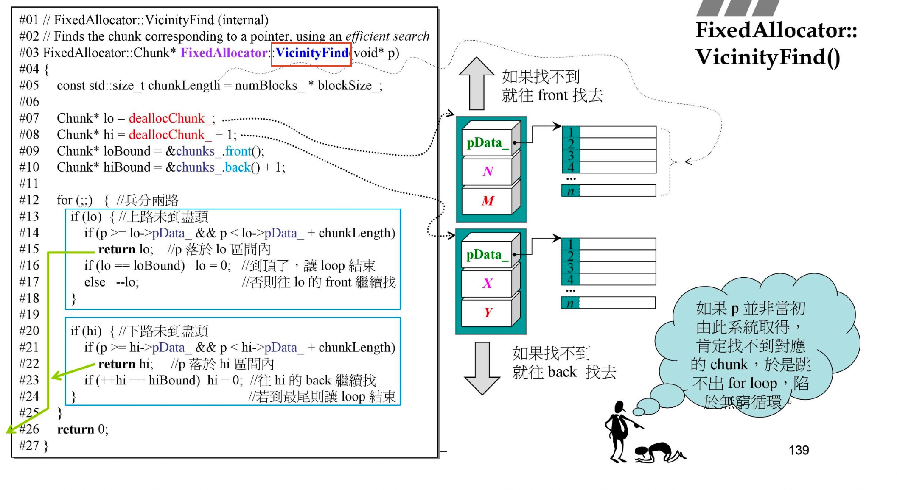
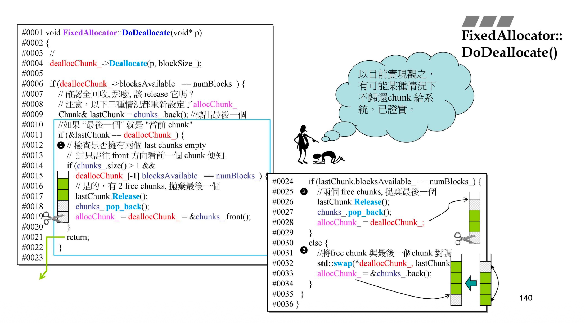
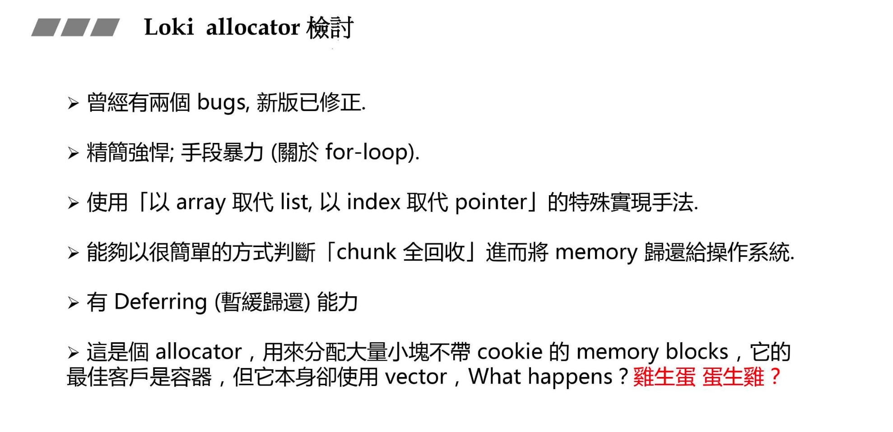

# C++ 内存管理 · 第四讲 Loki allocator

> 来源：[xubenshan.github.io — 第四讲 Loki allocator](https://xubenshan.github.io/blog/cpp/C__%E5%86%85%E5%AD%98%E7%AE%A1%E7%90%86/%E7%AC%AC%E5%9B%9B%E8%AE%B2loki_allocator.html)
> 作者：小熊 | 2026/7/19

本讲剖析 Loki 库中 SmallObjAllocator 的三个 class 嵌套结构（chunk → FixedAllocator → SmallObjAllocator），并讨论其实现中的一个小 bug 及修复方法。

---

## 三个 class 结构

嵌套的数据结构设计：最底层是 chunk，chunk 有三个成员，firstAvailableblock 代表下次可以用的第一个区块索引；blocks available 代表可用区块的数量。依次往上，最高层是 smallobjallocator。用户看到的是 smallobjallocator。



chunk 类中有一些函数：重点来看 reset 中有一个流水号索引设置。i 的类型是 unsigned int，代表一个字节大小的无符号整数。用 int 的话，4 个字节，会增加开销。空闲 block 第一个字节用于保存下一个 block 的编号，和嵌入式指针有些像。

FixedAllocator 是个类，类里面又定义了一个类，叫 chunk。chunk 中有 init 函数、release 函数、allocate 函数、deallocate 函数。所以下图函数定义的时候名字写的很长。



allocator 动作结合代码和图片不难理解，主要就是理清 firstAvailableBlock、blocksAvailable 的含义。



首先要确定回收的 p 是落在哪个 chunk 里面的。每个 chunk 管理的内存的起点和块个数是知道的，所以可以确定 p 是在哪个 chunk 中。之后再进入 deallocate 函数。（p - 首地址）/ 块大小，就能得到这个块应该放在 chunk 的哪个位置。



第二个类 FixedAllocator 的 allocate 和 deallocate 函数。

来看下代码的细节：

allocChunk 指向上一次满足分配的 chunk，下一次再分配内存的时候就让这个 chunk 分配（从这个 chunk 中取区块）。

deallocChunk 指向上一次内存回收到的那个 chunk。下一次回收的时候，可以先看看 p 是否属于该 chunk。

Chunks_ 是一个容器，容器每个元素都是 chunk 对象。类似这种：

```cpp
typedef std::vector<Chunk> Chunks;
Chunks chunks_;
```

```text
chunks_
┌─────────┬─────────┬─────────┬─────────┐
│ Chunk 0 │ Chunk 1 │ Chunk 2 │ Chunk 3 │
└─────────┴─────────┴─────────┴─────────┘
    ↑                                   ↑
 begin()                              end()
                                    末尾之后
```

`&*i` 是很特殊的形式。对 i 解引用得到的是 chunk 对象，再取地址，得到容器某个 chunk 元素的地址。



当所有 chunk 对象都没有可用的区块时，只能再 push_back 一个新的 chunk。`chunks_.push_back(Chunk())`，Chunk() 就是创建一个 Chunk 临时对象，然后拷贝到容器中，然后临时对象生命结束。

`deallocChunk_ = &chunks_.front()` 为什么要这么设值，因为 push_back 可能会发生隐藏的拷贝：如果原来的容量不足，vector 会重新分配更大的连续空间，把原来的 Chunk 搬到新空间，原本内存上的对象就会被销毁了。那么需要重新对 deallocChunk_ 设值，要不然会变成悬空指针。将其重新指向 chunks_.front()，是为了建立一个有效的释放搜索起点，而不是规定将内存释放到第一个 Chunk。

好，接下来我们再来研究下 Deallocate 方法。

先 VicinityFind，找到 p 指针所属的 chunk，然后用 deallocChunk_ 标记一下。下一次回收内存的时候，就先去看 p 指针是不是属于 deallocChunk_ 标记的 chunk。

下面是 vicinityFind 的源代码：



如果 p 当初并不是从这个系统中获取的（比如直接 malloc 获取的），那将 p 传入该函数，就会卡在 for 循环。所以上述代码应该先检查下 p 是不是从该系统获取的。

查找到 p 所在的 chunk 之后，接下来该调用 DoDeallocate 函数：

第 6 行 if 描述的是某个 chunk 全回收（全回收状态就是 chunk 里面没有正在使用的块了）后，需要延缓归还给 os，这个延缓动作在第三讲 free 也出现过。但这段代码有 bug，可能会导致不归还 chunk 给 os。



三种情况：

- 当前全回收 Chunk 就是最后一个 Chunk，此时检查倒数第二个 Chunk，如果也是全回收状态，说明现在有两个 chunk，把最后一个 chunk 归还给 os。
- 当前全回收 Chunk 不是最后一个 Chunk，但最后一个也是全回收状态。把最后一块归还给 os。再让当前全回收 Chunk 作为下一次分配使用的 Chunk。
- 其它情况：把当前全回收 Chunk 和最后一个 Chunk 交换内容，再让当前全回收 Chunk 作为下一次分配使用的 Chunk。

代码整体隐含了一个重要假设：如果存在一个保留的全回收 Chunk，它应当位于 chunks_ 的末尾。

初始有五个 Chunk：

```text
[A 使用] [B 使用] [C 使用] [D 使用] [E 空闲]
```

第一次：B 完全释放

此时：

```text
deallocChunk_ = B
lastChunk     = E
```

因为 E 也是空闲的，代码释放 E：

```text
[A 使用] [B 空闲] [C 使用] [D 使用]
```

现在唯一的空 Chunk B 留在了中间，而不是尾部。

第二次：D 完全释放

现在变成：

```text
[A 使用] [B 空闲] [C 使用] [D 刚变空]
```

D 是最后一个 Chunk，因此代码进入：

```cpp
if (&lastChunk == deallocChunk_)
```

然后它只检查前一个 Chunk：

```cpp
deallocChunk_[-1]  // 即 C
```

但 C 正在使用，因此代码认为只有一个空 Chunk，直接返回。

最终状态：

```text
[A 使用] [B 空闲] [C 使用] [D 空闲]
```

现在已经存在两个完全空闲的 Chunk，但代码没有释放其中任何一个。

如何修改该 bug：

第二个分支：释放旧尾部 Chunk 后，把当前新产生的空 Chunk 移到新的尾部。然后第一个分支也不需要检查倒数第二个 Chunk 是不是全回收状态了。

```cpp
if (lastChunk.blocksAvailable_ == numBlocks_)
{
    // 旧尾部 Chunk 已经是空的，释放它管理的内存
    lastChunk.Release();
    chunks_.pop_back();

    // pop_back 后重新取得新的尾部，不能继续使用原 lastChunk 引用
    Chunk* newLastChunk = &chunks_.back();

    // 把当前新产生的空 Chunk 移到 vector 尾部
    if (deallocChunk_ != newLastChunk)
    {
        std::swap(*deallocChunk_, *newLastChunk);
    }

    // 空 Chunk 现在位于尾部
    allocChunk_ = newLastChunk;
    deallocChunk_ = newLastChunk;
}
```

旧代码为什么要检查倒数第二个：因为旧代码的其他分支可能制造这种错误状态：

```text
[使用] [空闲] [使用]
```

随后最后一个 Chunk 也变空，就变成：

```text
[使用] [空闲] [空闲]
```

如果状态是：

```text
[使用] [空闲] [使用] [空闲]
```

只检查倒数第二个是没有用的，按理说应该释放一个空闲 Chunk，但此时系统认为只有一个空闲 Chunk。不会释放给操作系统。

---

## loki allocator 检讨



回答下最后一个问题：loki 分配器中使用了 vector，这个 vector 用的是标准库的分配器。等 loki 分配器生成后，容器就可以指定使用 loki 分配器了。所以不存在蛋生鸡鸡生蛋的问题。

---

> 上一篇：第三讲 malloc/free　|　下一篇：第五讲 other allocator
