# C++ 内存管理 · 第二讲 std::allocator

> 来源：[xubenshan.github.io — 第二讲 std::allocator](https://xubenshan.github.io/blog/cpp/C__%E5%86%85%E5%AD%98%E7%AE%A1%E7%90%86/%E7%AC%AC%E4%BA%8C%E8%AE%B2std_allocator.html)
> 作者：小熊 | 2026/7/19

本讲核心：

1. 各编译器（VC6 / BC5 / GCC）自带的 `allocator` 本质上都是对 `malloc/free` 的简单封装，分配出的内存带有 cookie。
2. 想要去除 cookie，前提是「内存块大小一致」；大小不一就必须用 cookie 记录区块大小。
3. GCC 2.9 真正使用的是 `std::alloc`（二级分配器），它用 16 条链表 + 战备池（pool）管理 8~128 字节的小块，从而省掉 cookie。
4. `std::alloc` 分两级：第二级（`__default_alloc_template`）处理 ≤128 字节的小块，第一级（`__malloc_alloc_template`）用 `malloc/free` 处理大块。

---

## 一、malloc() 内部原理

### 1、VC6.0 malloc

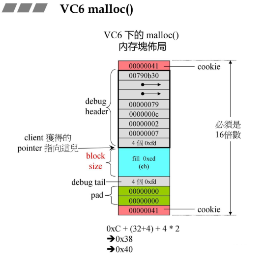

从上图可见，VC6 中的 malloc() 函数分配的内存里面除了我们需要申请的内存空间外还有 cookie、debug 信息和 pad，其中 cookie 是我们不需要的，如果大量调用 malloc 的话 cookie 总和会增多，这会造成较大的浪费。

不同的编译器所附带的标准库里头的分配器做法可能不一样。

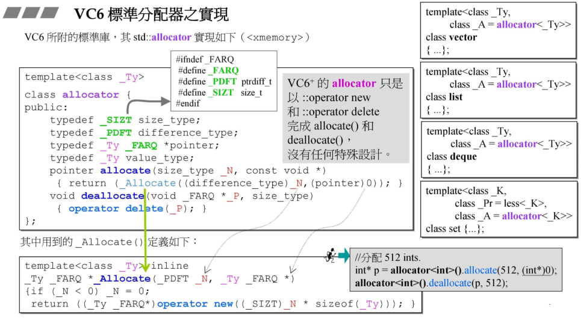

从上面可以看出，VC6.0 的 allocate() 函数只是对 malloc 的二次封装，并没有做什么很特殊的操作，它是以类型字节长度为单位分配内存的，上图就分配了 512 个 int 类型空间。如果类型是 double，那 allocate 第一个参数填 512，代表分配 512 个 double 类型空间。

补充：右下角那两行代码是干啥的。

```cpp
//如果我们在自己的程序里，想跳过 vector、list 等容器，直接赤裸裸地调用 VC6 的这个 allocator 来分配内存，该怎么写。
int* p = allocator<int>().allocate(512, (int*)0);//512个int大小的空间
allocator<int>().deallocate(p, 512);
```

### 2、BC5 malloc

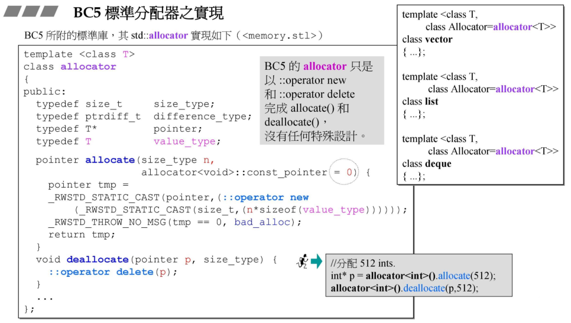

BC5 的 allocate() 函数和 VC6.0 本质一样。

我们的目标是要去除 cookie。去除 cookie 的一个先决条件就是内存块大小要一样，如果有大有小，就必须用 cookie 来记录区块大小了，就不能去掉了。

### 3、G2.9 malloc

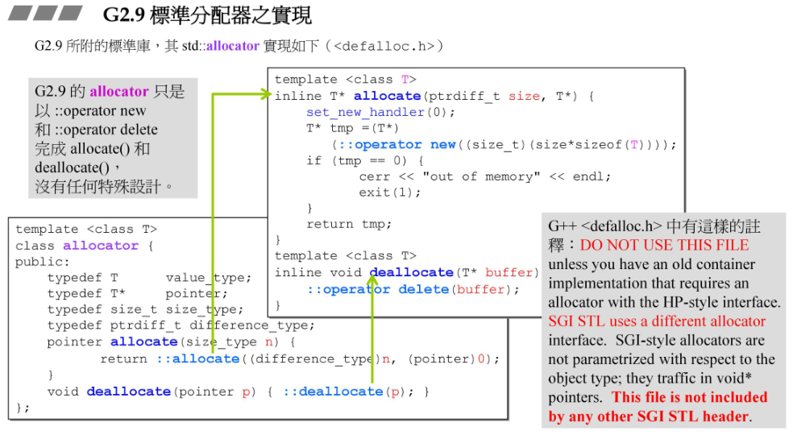

GCC 2.9 版本的 allocator 如上图所示，但是在实际中该部分却没有被包含使用，从下图容器使用的 Alloc 可以看到，实际的分配器是使用了一个叫 alloc 的类，该类分配内存是以字节为单位的，而不是以对象为单位。下图右边灰色部分分配的是 512 字节，而不是 512 个对象。

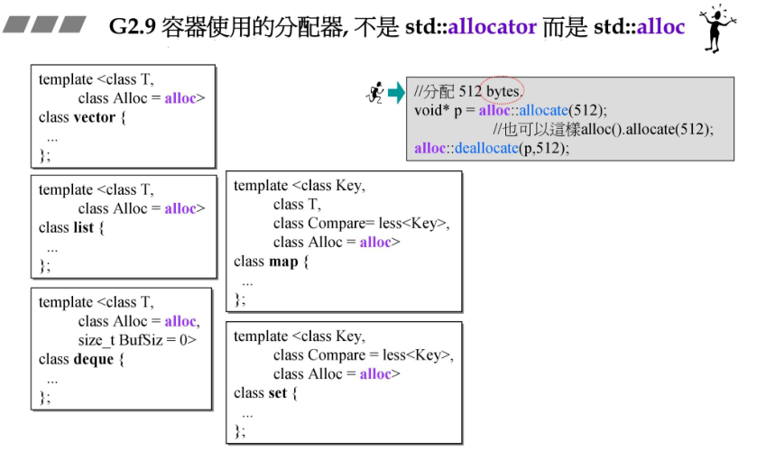

### 4、__pool_alloc

在 GCC 4.9 版本，2.9 版本的 allocate 不属于正式使用的那个版本，而是变成了 `__pool_alloc`：

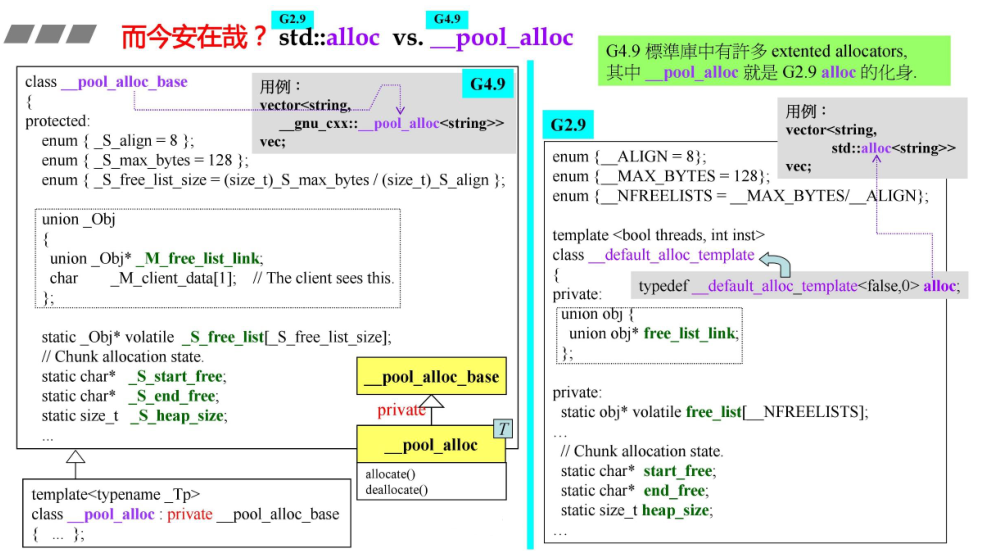

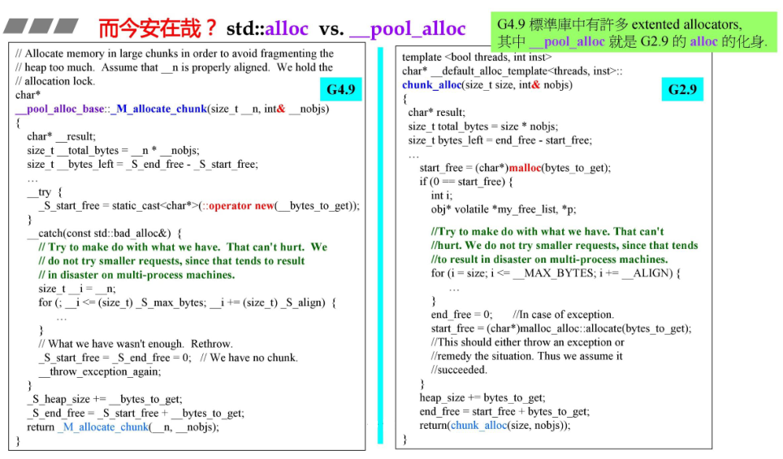

从上面两张图可以对比看出，2.9 版本的 allocate 和 4.9 版本的 `__pool_alloc` 做的事是一样的，只是修改了变量名和一些细小操作而已。

下图是标准分配器的实现，标准分配器说的是 allocator。

```text
父类/基类：__gnu_cxx::new_allocator<T>
                    ↑
子类/派生类：std::allocator<T>
```

G4.9 标准分配器只是类的关系变复杂了，除此之外，也没有特殊的设计。

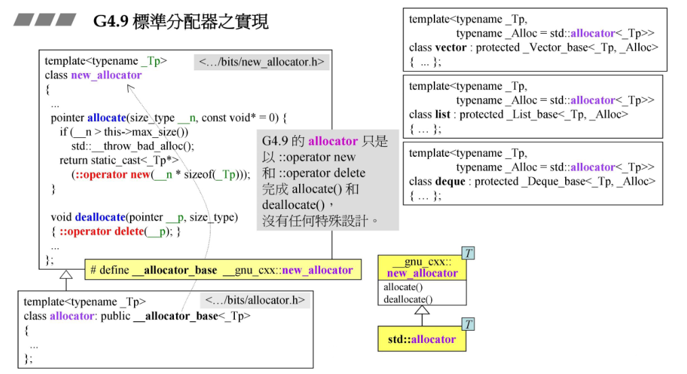

`cookie_test` 第一个实参是 `_pool_alloc<double>()`（加括号是表示创建临时对象），表示分配器的类型是 `_pool_alloc<double>`。第二个实参是 1，传入 cookie_test 后，`alloc.allocate(1)` 表示分配一个 double 类型的空间，也就是八个字节。

分配了三次，打印出地址，会发现相距 8 个字节。可以看出用 alloc 分配器分配的内存没有了 cookie。

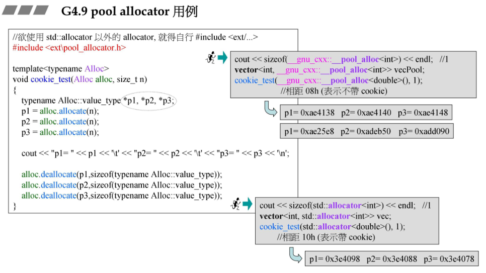

测试的代码如所示：

```cpp
#include <iostream>
#include <vector>
#include <ext\pool_allocator.h>

using namespace std;

template<typename Alloc>
void cookie_test(Alloc alloc, size_t n)
{
    typename Alloc::value_type *p1, *p2, *p3;		//需有 typename
  	p1 = alloc.allocate(n); 		//allocate() and deallocate() 是 non-static, 需以 object 呼叫之.
  	p2 = alloc.allocate(n);
  	p3 = alloc.allocate(n);

  	cout << "p1= " << p1 << '\t' << "p2= " << p2 << '\t' << "p3= " << p3 << '\n';

  	alloc.deallocate(p1,sizeof(typename Alloc::value_type)); 	//需有 typename
  	alloc.deallocate(p2,sizeof(typename Alloc::value_type));  	//有些 allocator 對於 2nd argument 的值無所謂
  	alloc.deallocate(p3,sizeof(typename Alloc::value_type));
}

int main(void)
{
	cout << sizeof(__gnu_cxx::__pool_alloc<double>) << endl;
	vector<int, __gnu_cxx::__pool_alloc<double> > vecPool;
	cookie_test(__gnu_cxx::__pool_alloc<double>(), 1);

	cout << "----------------------" << endl;

	cout << sizeof(std::allocator<double>) << endl;
	vector<int, std::allocator<double> > vecPool2;
	cookie_test(std::allocator<double>(), 1);

	return 0;
}
```

测试环境是 Dev C++5.1.1 版本，GCC 4.9，测试结果如下：

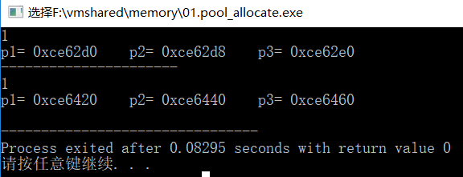

从上面的测试结果可以看出，如果使用了 `__pool_alloc` 的话，连续两块内存之间的距离是 8，而一个 double 类型变量的大小也是 8 个字节，说明这连续几块内存之间是不带 cookie 的（即使这几块内存在物理上也是不连续的）。如果使用 std 的 allocator，那么相邻两块内存之间距离为 18 个字节，每块内存带有一个 4 字节的头和 4 字节的尾。

---

## 二、std::alloc

### 1、std::alloc 运作模式

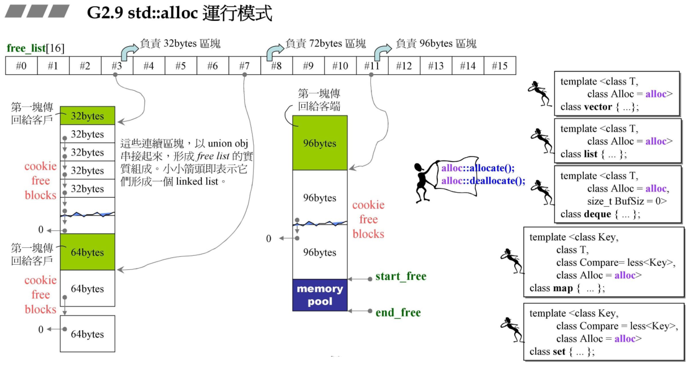

`std::alloc` 使用一个 16 个元素的数组来管理内存链表，而我们上一章只是用了一条链表。数组不同的元素管理不同的区块，例如 #1 号元素负责管理块大小为 8 个字节；依次类推，#3 号元素负责管理 32 bytes 为一小块的链表。

假设现在用户需要 32 字节（如果用户需要 30 个字节，分配器也会给他分配 32 个字节。总之不管用户要多少，分配器都会分配 8 的倍数）的内存，`std::alloc` 先申请一块区间，为 32×20×2 大小，用一条链表管理，然后让数组的 #3 元素管理这条链表。接着将该以 32 为一个单元的链表的一个单元（32 字节）分给用户。为什么是 32×20×2？前 32×20 空间是分配给用户的，但是后面的 32×20 空间是预留的，称为战备池。如果这时用户需要一个 64 字节的空间，那么剩下的 32×20 空间将变成 64×10，然后将其中 64 字节分配给用户，而不用再一次地申请空间和构建链表。

但是也有上限。如果该链表组维护的链表最大的一个小块为 128 byte，但是用户申请内存块超过了 128 byte，那么 `std::alloc` 将调用 malloc 给用户分配空间，然后该块将带上 cookie 头和尾。

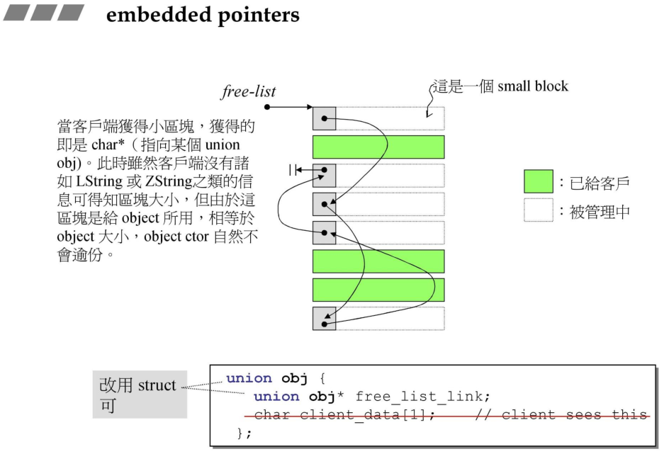

在真正的商业级的内存分配器中，一般都会使用嵌入式指针，将每一个小块的前四个字节用作指针连接下一块可用的内存块。

### 2、std::alloc 运行一瞥

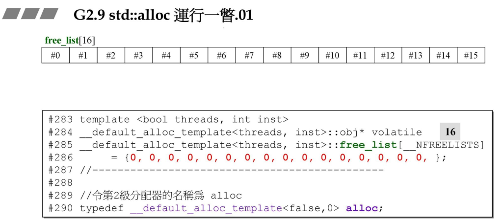

用户一般不要直接去用分配器，因为你需要记住想要的内存大小，将来还给分配器的时候需要传入内存的大小。而容器元素大小是一样的，所以我们需要通过容器来索要内存。申请 32 个字节，指的是容器想要 32 个字节。

`roundup` 是追加量，`pool` 指的是战备池大小。

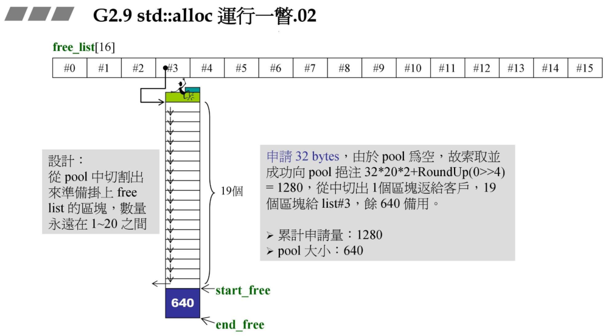

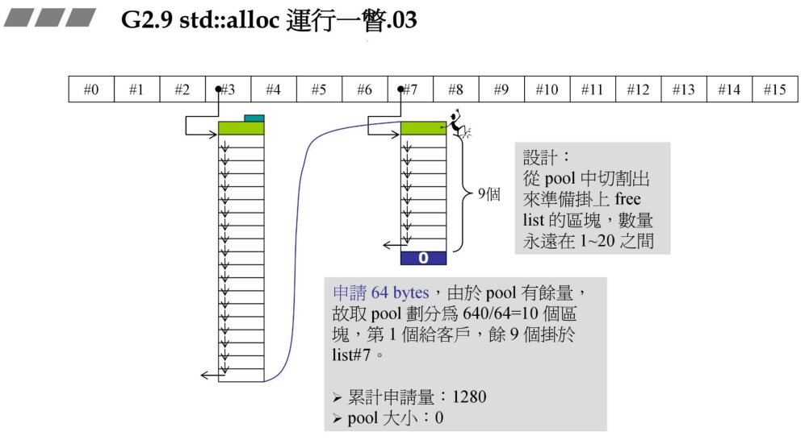

再申请 96 字节，战备池已经没有多余的内存了，只能通过 malloc 向操作系统申请内存，大小为 96×20×2+roundup。这个 roundup 怎么算呢？累计申请量 >>4 也就是除以 16，再调到 8 的倍数。申请的内存大小总共 3920 字节。申请 96 个字节，所以空闲链表的大小应该是 96×20=1920 字节，剩余 2000 字节，作为战备池。

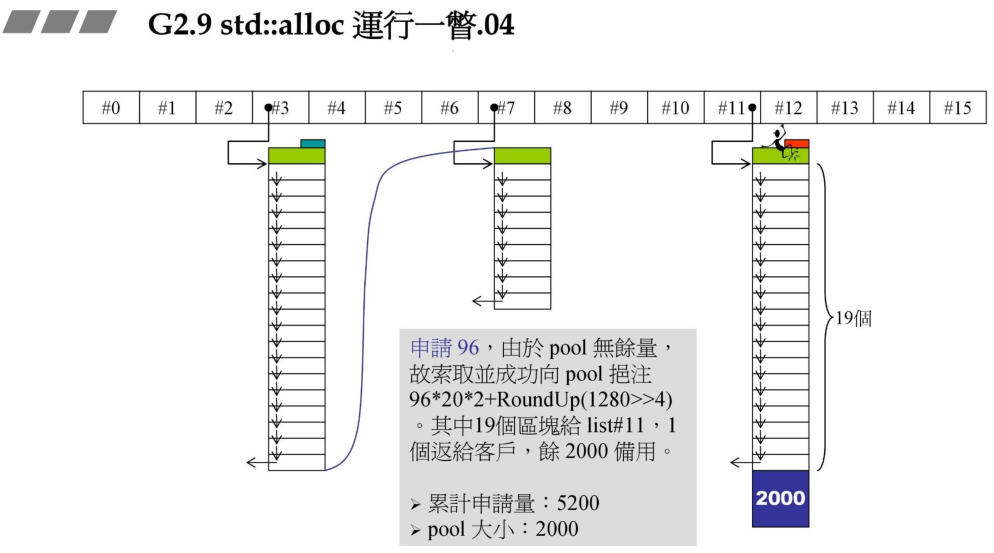

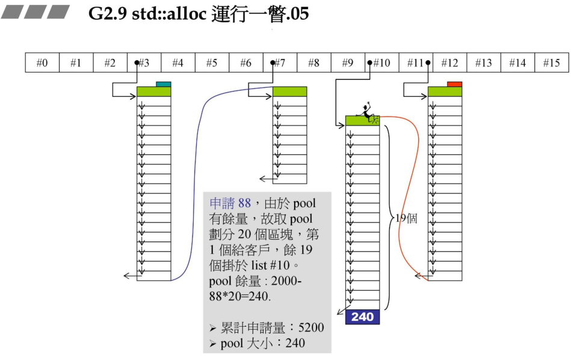

某个容器连续发出三次请求，可以直接从 #10 对应的自由链表中拿三个空闲块。

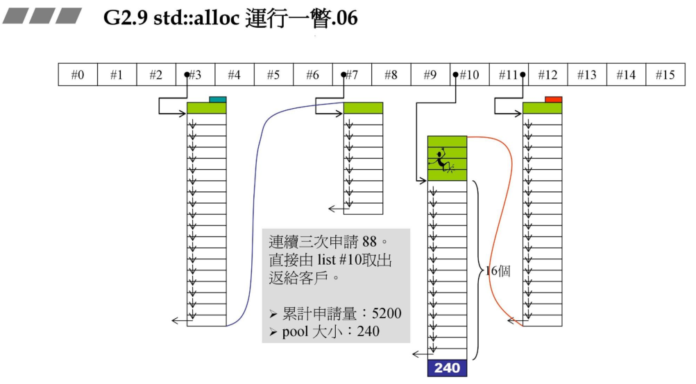

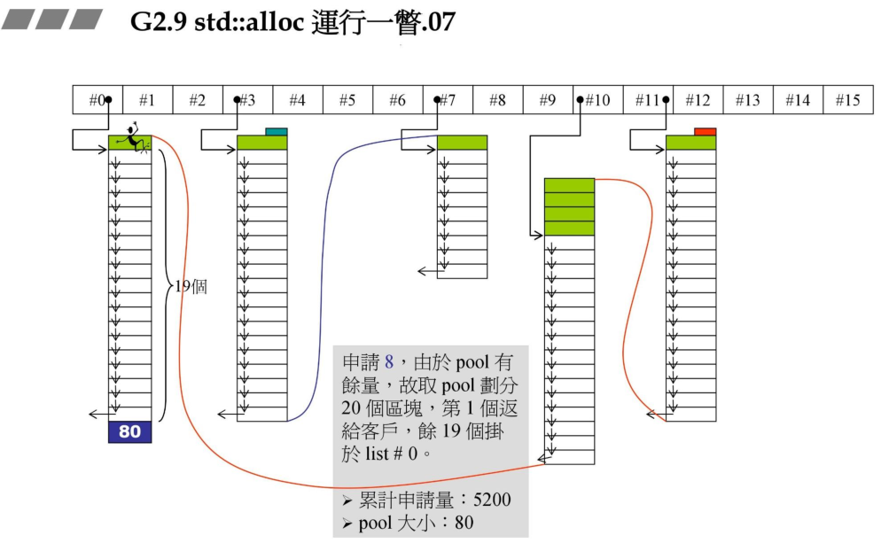

下面这页是经典的碎片处理。由于战备池大小是 80，但是容器申请 104 字节，战备池不够分配，如何处理这 80 个字节。把 80 交给 #9。因为 #9 管理的就是 80 个字节大小的内存块。

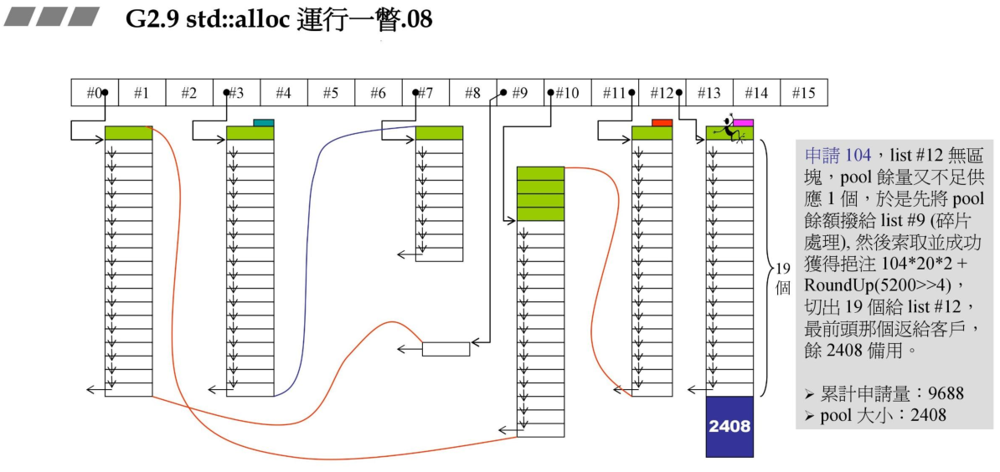

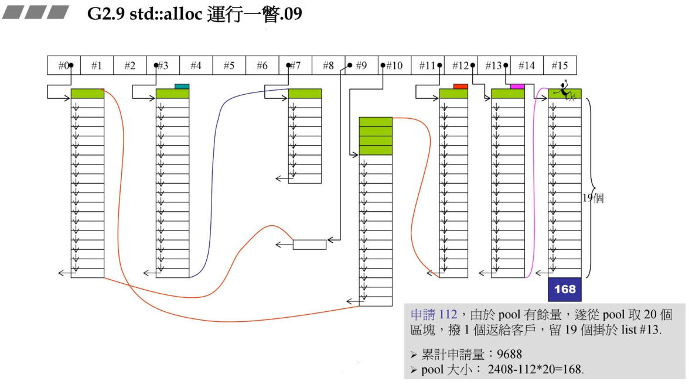

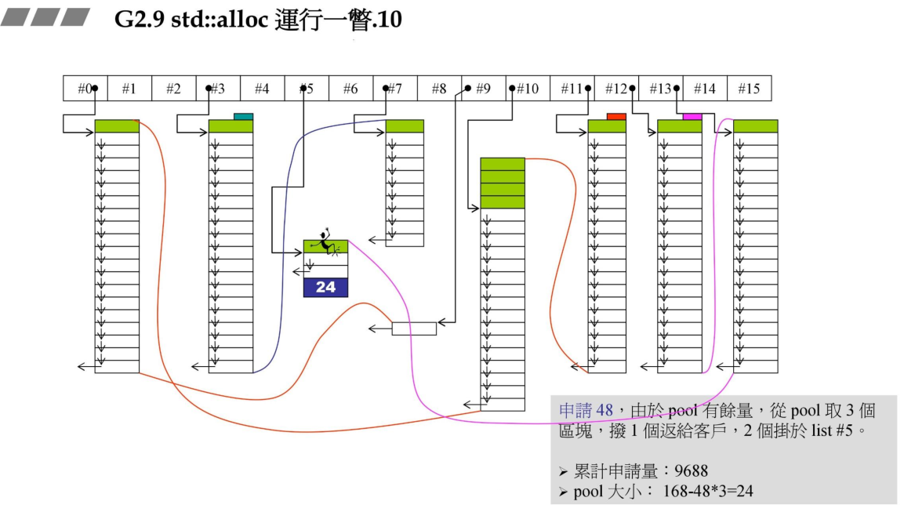

走到山重水尽之后，该怎么办？

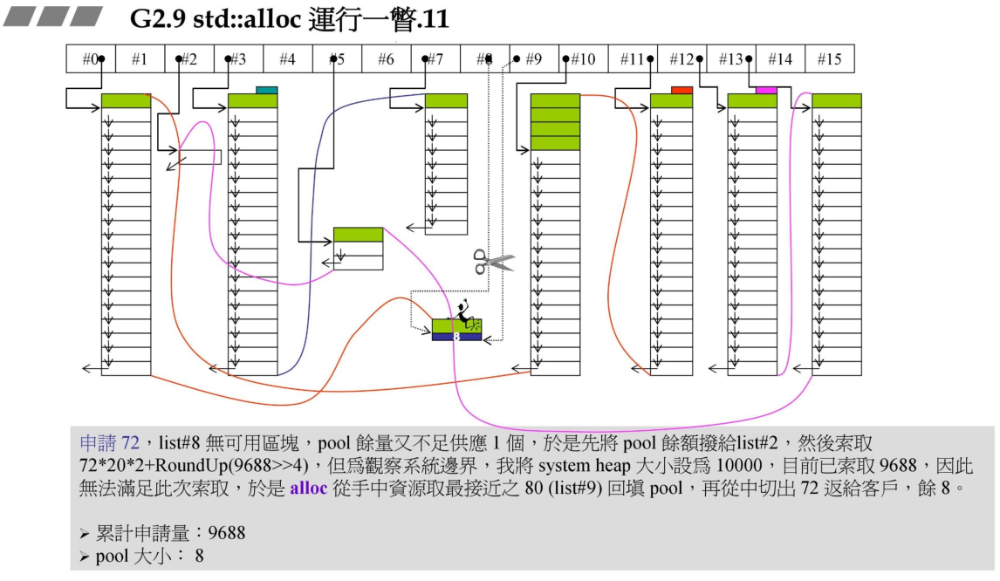

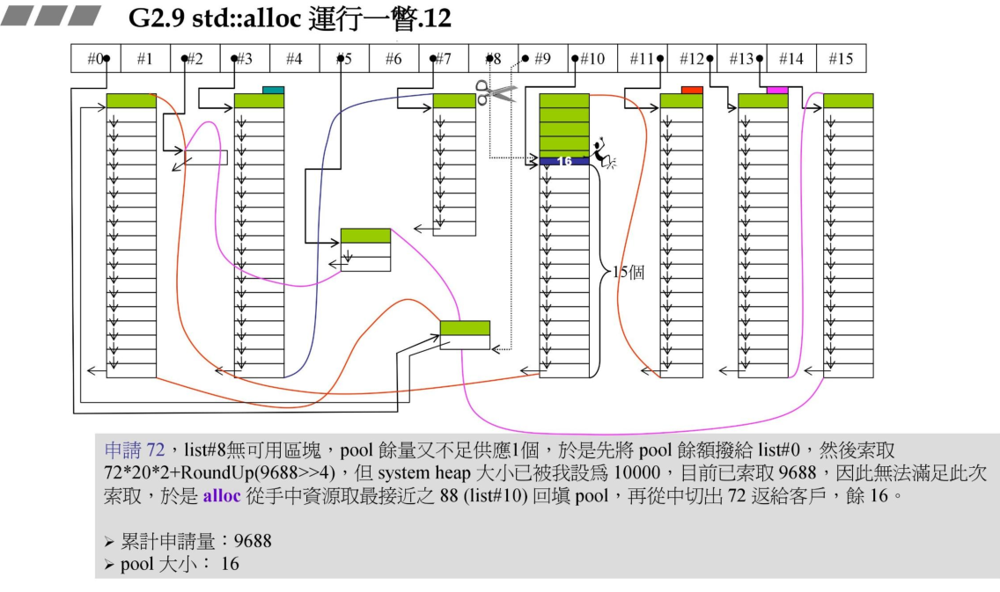

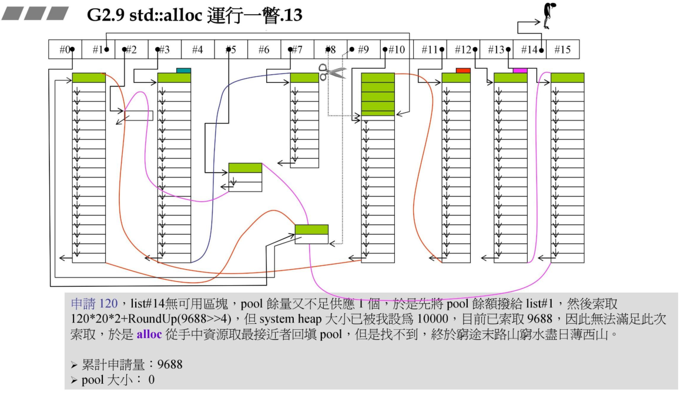

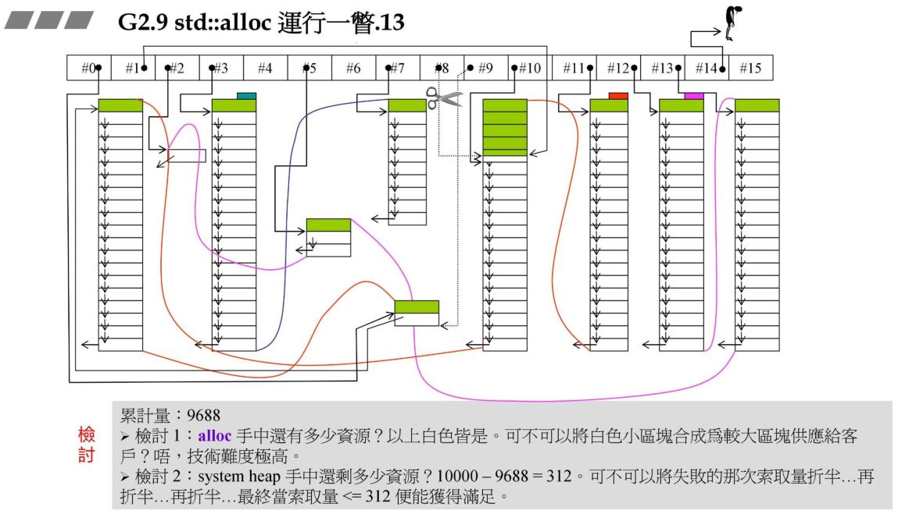

### 3、std::alloc 源码剖析

侯杰老师的 ppt 上总结的很好，在看这部分内容时需要结合老师的 ppt，为了方便分析，这里结合老师的课程，使用「倒叙」的方式，先介绍中间的几张 ppt，然后跳回前面，顺序和原版 ppt 不一样。

原版 ppt 的 1-3 张介绍的是 GCC 2.9 的 std::alloc 的第一级分配器，这里先从第二级开始分析，然后再到第一级。

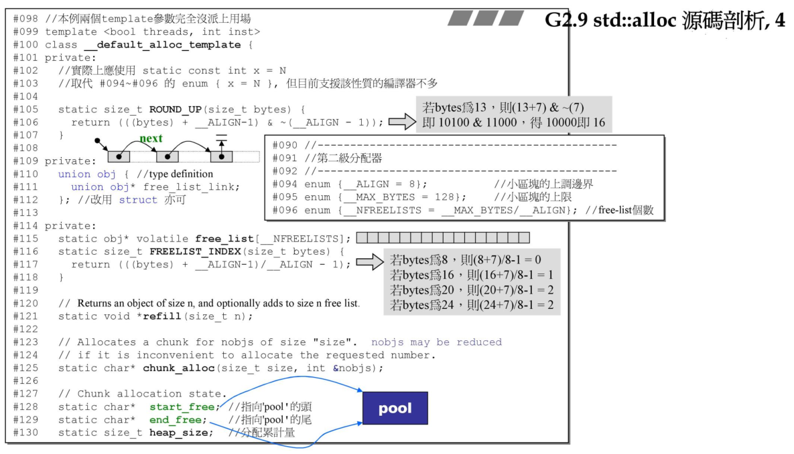

该分配器为 `__default_alloc_template`，一开始默认使用的分配器，在该类中定义了 `ROUND_UP` 函数，用来将申请内存数量做 16 字节对齐。定义了 `union free_list_link`，在后面会介绍它的作用，在上一章中我们构建的一个小的分配器中也定义了该联合体，作用类似，该联合体可以使用 struct 代替。`free_list` 是一个有 16 个 `obj*` 元素的数组（`obj* free_list[]`，free_list 是一个指针数组，也就是一个数组，每个元素是指针）。在前面讲过，GCC 2.9 的分配器用一个 16 字节数组管理 16 条链表，free_list 便是该管理数组。`refill` 和 `chunk_alloc`（chunk 表示一大块、block 表示一个个小块）在后面再介绍。`start_free` 和 `end_free` 分别指向战备池的头和尾。

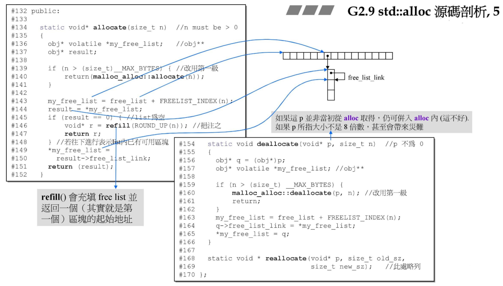

首先看 allocate 函数，在函数的一开始便定义了：

```cpp
obj* volatile *my_free_list;
```

结合上图右侧的链表图和上上一张图片内容，`my_free_list` 指向的是 free_list 中 16 个元素中的任何一个，`*my_free_list` 则取出 free_list 某元素中的值，该值是个地址，指向一条分配内存的链表。所以 `my_free_list` 要定义为二级指针。

`result` 则保存分配给用户的一块内存的地址。

首先：

```cpp
if (n > (size_t)__MAX_BYTES) {
    return(malloc_alloc::allocate(n));
}
```

检查用户申请内存块大小，如果大于 `__MAX_BYTES`（128）那么将调用 `malloc_alloc::allocate()`，这便是第一级分配器，这在后面分析。现在假设用户申请内存小于 128 字节，那么将根据用户申请内存大小分配对应的内存，由于内存池使用 free_list 链表管理的，每个 free_list 链表元素管理不同的内存块大小，这在前面介绍过了。于是有：

```cpp
my_free_list = free_list + FREELIST_INDEX(n);//free_list指向#0，存储#0的地址。
//这里的加法相当于&free_list[FREELIST_INDEX(n)]。
```

定位到该内存块的位置，这时 `my_free_list` 指向的是管理该内存块的空间的地址，使用 `*my_free_list` 便可以取到该内存块的地址：

```cpp
result = *my_free_list;
```

然后判断 result 是否为空：

```cpp
if (result == 0) {
    void* r = refill(ROUND_UP(n));
    return r;
}
```

如果为空，说明系统内存不够用了，将使用 `refill()` 函数分配内存，这部分在后面会介绍。

如果情况正常，那么将该链表中下一个可以使用的空间设置为当前分配给用户空间指向的下一个、在逻辑上连续的空间，最后将 result 返回给用户：

```cpp
*my_free_list = result->free_list_link;
return (result);
```

下面的这张图很形象地演示了内存分配的过程：

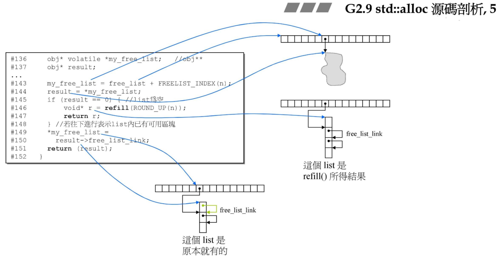

接下来分析释放内存。

```cpp
  static void deallocate(void *p, size_t n)  //p may not be 0
  {
    obj* q = (obj*)p;
    obj* volatile *my_free_list;   //obj** my_free_list;

    if (n > (size_t) __MAX_BYTES) {
        malloc_alloc::deallocate(p, n);
        return;
    }
    my_free_list = free_list + FREELIST_INDEX(n);
    q->free_list_link = *my_free_list;
    *my_free_list = q;
  }
```

释放内存的代码也不难理解，找到需要释放内存的那块空间的地址，然后将当前可分配给用户的空间地址设置为需要释放的该内存空间，一开始指向的可分配的内存空间地址赋值给需要释放空间地址的逻辑连续的下一个内存地址。感觉十分拗口，图和代码更能体现这一过程：

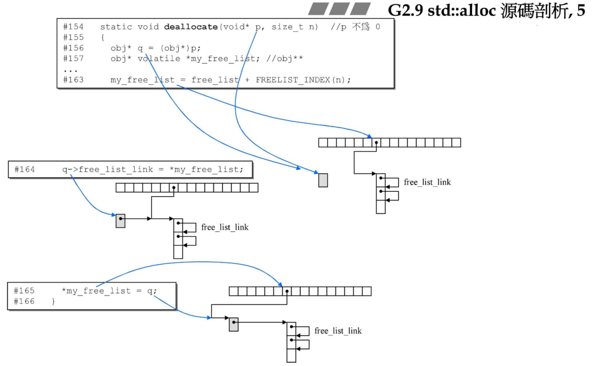

我们可以看出两个问题：

- `deallocate` 并没有调用 free，也就是没有把释放的内存交给操作系统，而是留在了自己设计的自由链表中。
- `deallocate` 第一个参数 p，并没有检查是不是当时 allocate 的时候分配的。

接下来再来看一下 `refill` 函数。当 result 为 0 的时候，说明 #number 没有挂自由链表。需要通过调用 `chunk_alloc` 得到一大块内存，再把这一大块内存做切割，切成符合要求的一个个小块。

`nobjs` 传的是引用，初始传进去是 20，但战备池可能提供不了 20，所以在战备池内部 nobjs 会被修改成最多能拿的个数，当然不能超过 20。

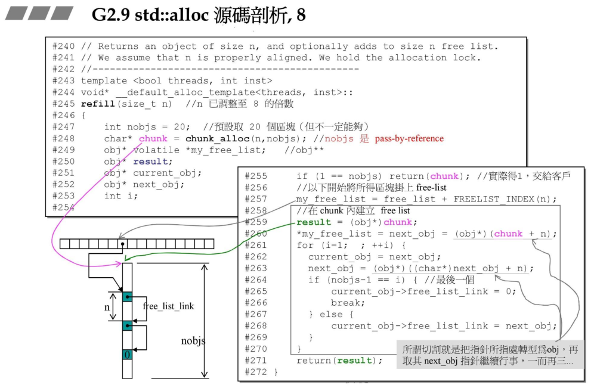

```cpp
result = (obj*)chunk; //第一块直接给用户。
*my_free_list = next_obj = (obj*)(chunk + n);//找到第二块的起始地址，作为自由链表头。
```

```cpp
//循环把剩余块串起来
//i也可以从0开始，不过终止条件就要换成i == nobjs - 2。为了语义更明显，i最好从1开始，代表第0个内存块直接用来分配给用户，不需要进行切割。
```

接下来分析最难的一个函数：`chunk_alloc` 函数。用来分配一大块内存。战备池有空间就从战备池拿，没空间就从操作系统拿。

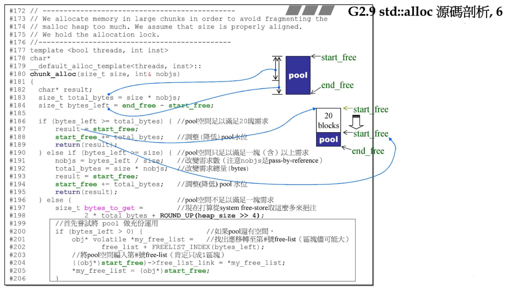

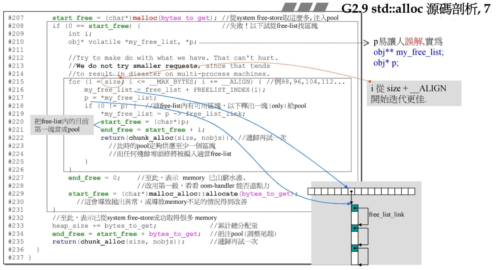

该函数声明如下：

```cpp
template <bool threads, int inst>
char*
__default_alloc_template<threads, inst>::
chunk_alloc(size_t size, int& nobjs)
```

函数一开始计算了一些需要的值：

```cpp
char* result;
size_t total_bytes = size * nobjs;
size_t bytes_left = end_free - start_free;
```

result 指向分配给用户的内存，total_bytes 为需要分配的内存块的大小，bytes_left 则是当前内存池中剩余的空间大小。

然后：

```cpp
if (bytes_left >= total_bytes) {
  result = start_free;
  start_free += total_bytes;
  return(result);
}
```

判断如果内存池剩余的内存大小多余需要分配的内存块大小，那么将内存池的首地址 start_free 直接赋值给 result，然后将 start_free 指针下移 total_bytes 距离，将当下的 result~start_free 之间的空间返回给用户。

当然，如果 bytes_left 比 total_bytes 小，但是却比 size 大：

```cpp
else if (bytes_left >= size) {
      nobjs = bytes_left / size;
      total_bytes = size * nobjs;
      result = start_free;
      start_free += total_bytes;
      return(result);
  }
```

这意味着不能直接分配 size * nobjs 大小内存给用户，那么可以先看看内存池当下的空间能分配多少个 size 大小的块给用户，然后将该块分配给用户，start_free 指针移动 total_bytes 长度。

```cpp
  size_t bytes_to_get =
             2 * total_bytes + ROUND_UP(heap_size >> 4);
  // Try to make use of the left-over piece.
  if (bytes_left > 0) {
      obj* volatile *my_free_list =
             free_list + FREELIST_INDEX(bytes_left);

      ((obj*)start_free)->free_list_link = *my_free_list;
      *my_free_list = (obj*)start_free;
  }
```

这部分查看内存池里面还有没有多余的内存，如果有，就充分利用。然后就是不断地获取内存块，将这些内存块不断切割用链表连接起来，递归这些过程：

```cpp
  start_free = (char*)malloc(bytes_to_get);
  if (0 == start_free) {
      int i;
      obj* volatile *my_free_list, *p;

      //Try to make do with what we have. That can't
      //hurt. We do not try smaller requests, since that tends
      //to result in disaster on multi-process machines.
      for (i = size; i <= __MAX_BYTES; i += __ALIGN) {
          my_free_list = free_list + FREELIST_INDEX(i);
          p = *my_free_list;
          if (0 != p) {
              *my_free_list = p -> free_list_link;
              start_free = (char*)p;
              end_free = start_free + i;
              return(chunk_alloc(size, nobjs));
              //Any leftover piece will eventually make it to the
              //right free list.
          }
      }
      end_free = 0;       //In case of exception.
      start_free = (char*)malloc_alloc::allocate(bytes_to_get);
      //This should either throw an exception or
      //remedy the situation. Thus we assume it
      //succeeded.
  }
  heap_size += bytes_to_get;
  end_free = start_free + bytes_to_get;
  return(chunk_alloc(size, nobjs));
```

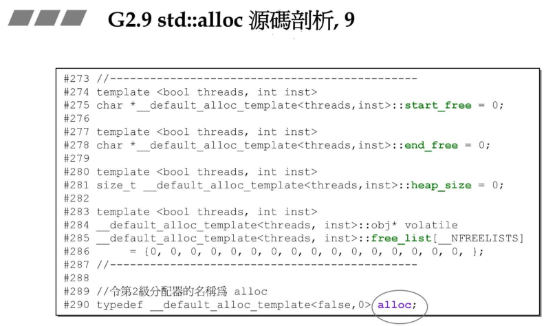

接下来看 alloc 观念大整理：先来看第一种没有 new 的，`Foo(1)` 会在栈上创建一个临时对象，把对象 push_back 进去。list 容器会向分配器要内存，这块内存大小包含 Foo 大小，还需要两根指针。这是 list 维护容器所需要的。内存分配好后，会把 `Foo(1)` 拷贝到该内存。然后 `Foo(1)` 临时对象就消失了。

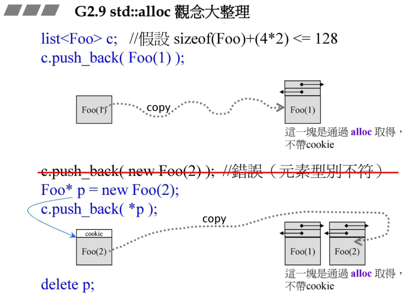

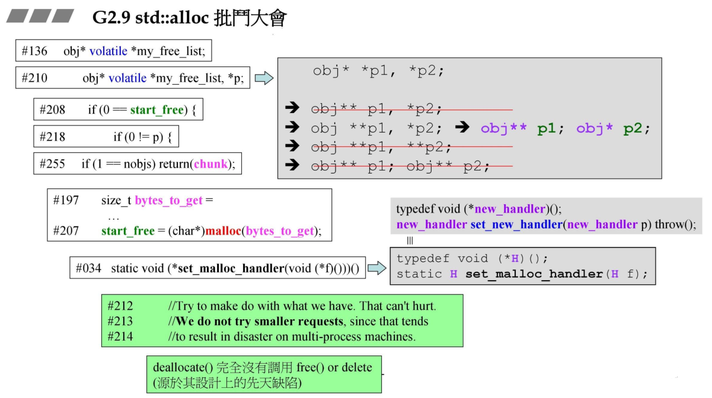

deallocate 没有把释放的内存回归给操作系统，因为设计上的先天缺陷：比如当初战备池不够了，调用 malloc 分配了一大块内存，p 存储首地址，把 p 对应的那小块分配给用户，就算记录了信息，将来该块回收到空闲链表，如果调用 free 的话，会有问题，因为有些块可能正在被使用。

之所以在 4.9 环境下观察，因为 2.9 alloc 分配器向操作系统申请内存直接用的 malloc，malloc 是不能被重载的，所以我们没办法写代码观察分配的次数和大小。但是 4.9 环境下使用的是 operator new 向操作系统要内存，是可以被重载的。

countNew 是 malloc 要的内存总量。timesNew 是调用 malloc 的次数，每调用一次 malloc 获得的内存都会带上下 cookie，共 8 字节。调用 1000 次 malloc，cookie 就占 8000 字节。

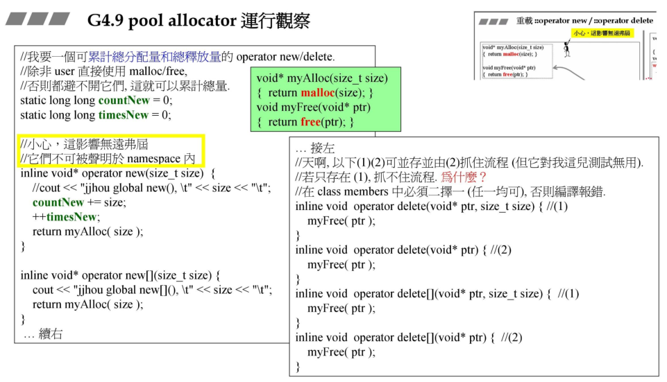

右图 `std::list<double>` 默认使用标准分配器 std::allocator，而标准分配器通常最终调用全局 `::operator new` 申请原始内存。list 每个对象是 double 类型，但 list 是双向链表，所以需要维护两个指针，因此每个块大小是 16 字节。push_back(i) 的时候就向分配器要 16 个字节。

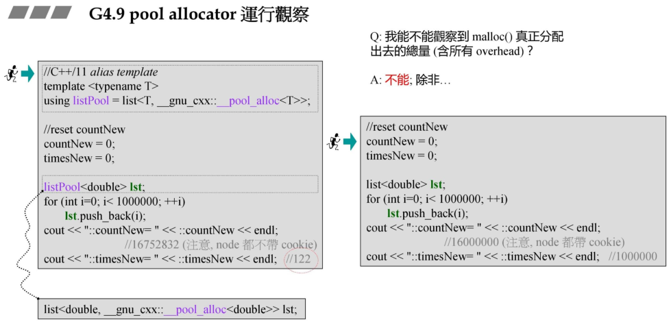

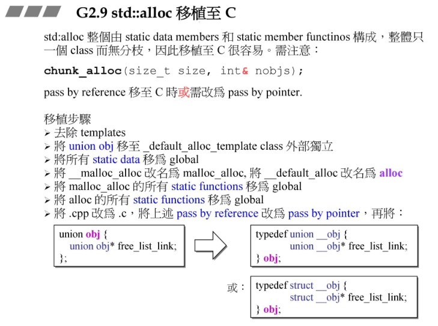

上面说到，不论是分配内存还是释放内存，则有：

```cpp
if (n > (size_t)__MAX_BYTES) {
    return(malloc_alloc::allocate(n));
}
```

和：

```cpp
if (n > (size_t) __MAX_BYTES) {
    malloc_alloc::deallocate(p, n);
    return;
}
```

也就是将内存分配与释放操作放到第一级 allocator 中：

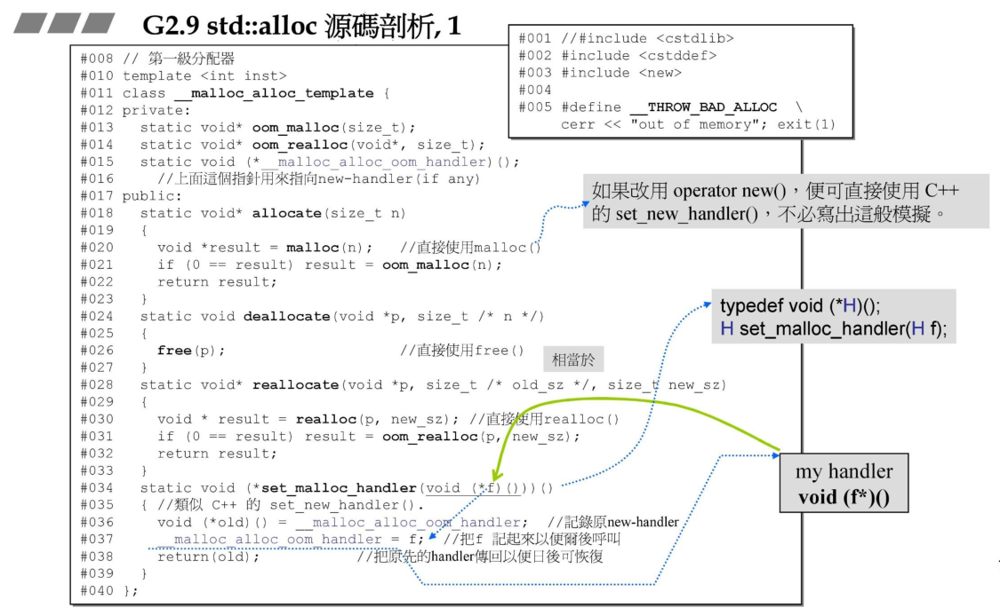

从上图中可以看到，第一级分配器叫做：

```cpp
class __malloc_alloc_template
```

其实有：

```cpp
typedef __malloc_alloc_template<0>  malloc_alloc;
```

这在后面会介绍。

分配器的 allocate 函数如下：

```cpp
  static void* allocate(size_t n)
  {
    void *result = malloc(n);   //直接使用 malloc()
    if (0 == result) result = oom_malloc(n);
    return result;
  }
```

直接调用 malloc 函数分配内存，如果分配失败则调用 oom_malloc 函数。

同样地，reallocate 也是如此：

```cpp
  static void* reallocate(void *p, size_t /* old_sz */, size_t new_sz)
  {
    void * result = realloc(p, new_sz); //直接使用 realloc()
    if (0 == result) result = oom_realloc(p, new_sz);
    return result;
  }
```

如果重新要求内存失败，则调用 oom_realloc 函数，这两个函数在后续会介绍。

deallocate 操作则直接释放内存：

```cpp
static void deallocate(void *p, size_t /* n */)
{
	free(p);                    //直接使用 free()
}
```

set_malloc_handler 是个函数指针，里面传入一个 `void (*f)()` 类型函数：

```cpp
  static void (*set_malloc_handler(void (*f)()))()
  { //類似 C++ 的 set_new_handler().
    void (*old)() = __malloc_alloc_oom_handler;
    __malloc_alloc_oom_handler = f;
    return(old);
  }
```

该函数设置的是内存分配不够情况下的错误处理函数，这个需要交给用户来管理，首先保存先前的处理函数，然后再将新的处理函数 f 赋值给 `__malloc_alloc_oom_handler`，然后返回旧的错误处理函数，这也在下一张图片中会介绍：

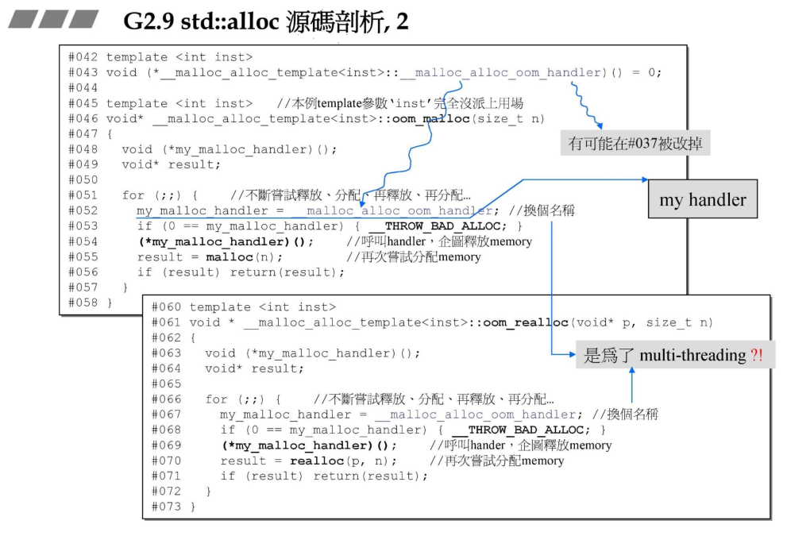

可以看到 oom_malloc 函数内部做的事：

```cpp
template <int inst>
void* __malloc_alloc_template<inst>::oom_malloc(size_t n)
{
  void (*my_malloc_handler)();
  void* result;

  for (;;) {    //不斷嘗試釋放、配置、再釋放、再配置…
    my_malloc_handler = __malloc_alloc_oom_handler;
    if (0 == my_malloc_handler) { __THROW_BAD_ALLOC; }
    (*my_malloc_handler)();    //呼叫處理常式，企圖釋放記憶體
    result = malloc(n);        //再次嘗試配置記憶體
    if (result) return(result);
  }
}
```

该函数不断调用 `__malloc_alloc_oom_handler` 和 malloc 函数，直到内存分配成功才返回。oom_realloc 也是如此：

```cpp
template <int inst>
void * __malloc_alloc_template<inst>::oom_realloc(void *p, size_t n)
{
  void (*my_malloc_handler)();
  void* result;

  for (;;) {    //不斷嘗試釋放、配置、再釋放、再配置…
    my_malloc_handler = __malloc_alloc_oom_handler;
    if (0 == my_malloc_handler) { __THROW_BAD_ALLOC; }
    (*my_malloc_handler)();    //呼叫處理常式，企圖釋放記憶體。
    result = realloc(p, n);    //再次嘗試配置記憶體。
    if (result) return(result);
  }
}
```

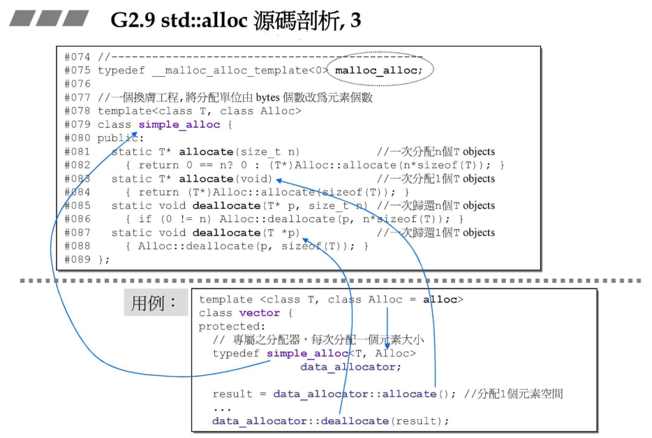

到这里，分配器只剩下 refill 函数没有分析了，下面将重点讨论该函数。不过在讨论 refill 函数之前有必要分析 chunk_alloc 函数。

---

> 上一篇：第一讲 primitives　|　下一篇：第三讲 malloc/free
